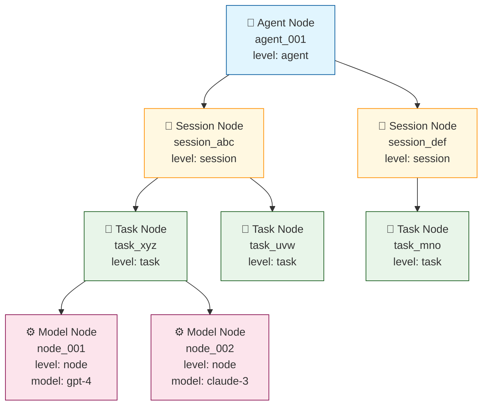

# 上下文服务设计文档

## 1. 概述

### 1.1 背景
上下文服务是 AI 系统的核心组件，负责管理 Agent 会话的上下文数据，包括上下文创建、存储、查询、压缩和同步等功能。

### 1.2 目标
- 提供统一的上下文管理能力，支持业务 Agent 和 SysAgent
- 实现高效的上下文缓存同步机制
- 支持上下文压缩，优化存储和传输
- 提供灵活的上下文组装能力

### 1.3 术语说明
| 术语 | 说明 |
|------|------|
| Agent | 智能体，包括业务 Agent 和 SysAgent |
| 上下文 | Agent 会话的历史记录、状态信息 |
| 上下文实例 | 特定 Agent 的上下文对象 |
| RAG | 检索增强生成服务（内置关系数据库） |

---

## 2. 架构设计

### 2.1 整体架构

```
┌─────────────────┐     ┌─────────────────┐
│  业务Agent服务   │     │   SysAgent服务   │
│  (上下文缓存)    │     │  (上下文缓存)    │
└────────┬────────┘     └────────┬────────┘
         │                       │
         │    ┌─────────────┐    │
         └────┤  上下文服务  ├────┘
              │  ContextSvc │
              └──────┬──────┘
                     │
                     ▼
            ┌─────────────────┐
            │   RAG服务        │
            │  (关系库+向量库)  │
            └─────────────────┘
```

### 2.2 模块划分

上下文服务包含以下核心模块：

| 模块 | 职责 |
|------|------|
| API网关模块 | 对外提供统一接口，包括实例管理、上下文写入、查询 |
| 上下文实例管理模块 | 管理 Agent 上下文实例的生命周期 |
| 上下文数据变更管理模块 | 处理上下文数据的变更和持久化 |
| 上下文处理模块 | 执行上下文压缩策略 |
| 上下文组装模块 | 组装完整上下文，供 LLM 使用 |
| 上下文缓存同步模块 | 与 Agent 端缓存进行双向同步 |

---

## 3. 模块详细设计

### 3.1 API网关模块

**职责**：对外暴露统一的上下文服务接口，负责请求路由、协议转换、权限校验。

**接口列表**：

| 接口 | 功能 | 调用方 |
|------|------|--------|
| 上下文实例管理接口 | 创建/更新/删除上下文实例 | SysAgent |
| 上下文写入接口 | 写入会话数据 | SysAgent、业务Agent |
| 上下文查询接口 | 查询上下文数据 | SysAgent |

**数据流**：
```
SysAgent → 上下文写入接口 → 上下文数据变更管理模块 → RAG
```

**接口定义**：

**1. 创建上下文实例接口**

| 项目 | 说明 |
|------|------|
| **接口地址** | `POST /context/v1/instance/create` |
| **调用方** | SysAgent |
| **功能描述** | 创建新的上下文实例，初始化模型调用链和Prompt模板 |

**Request参数**：

| 参数名 | 类型 | 必填 | 说明 |
|--------|------|------|------|
| agent_id | string | 是 | Agent唯一标识 |
| session_id | string | 是 | 会话唯一标识 |
| task_id | string | 否 | 任务唯一标识，task级实例必填 |
| agenttype | string | 是 | Agent类型枚举：sys_agent, qa_agent, travel_agent, shopping_agent, movie_agent |

**Response参数**：

| 参数名 | 类型 | 说明 |
|--------|------|------|
| code | int | 状态码，0表示成功 |
| message | string | 状态描述 |
| data.instance_id | string | 实例唯一标识 |

**调用示例**：

```bash
curl -X POST http://localhost:8080/context/v1/instance/create \
  -H "Content-Type: application/json" \
  -H "X-API-Key: your-api-key" \
  -d '{
    "agent_id": "agent_001",
    "session_id": "session_abc123",
    "task_id": "task_xyz789",
    "agenttype": "qa_agent"
  }'
```

**响应示例**：

```json
{
  "code": 0,
  "message": "success",
  "data": {
    "instance_id": "inst_001"
  }
}
```

---

**2. 更新上下文实例接口**

| 项目 | 说明 |
|------|------|
| **接口地址** | `PUT /context/v1/instance/{instance_id}/update` |
| **调用方** | SysAgent |
| **功能描述** | 更新指定实例的参数和上下文数据 |

**Path参数**：

| 参数名 | 类型 | 说明 |
|--------|------|------|
| instance_id | string | 实例唯一标识 |

**Request参数**：

| 参数名 | 类型 | 必填 | 说明 |
|--------|------|------|------|
| params | object | 否 | 更新的参数值 |
| context_data | object | 否 | 更新的上下文数据 |

**Response参数**：

| 参数名 | 类型 | 说明 |
|--------|------|------|
| code | int | 状态码 |
| message | string | 状态描述 |
| data.instance_id | string | 实例唯一标识 |
| data.updated_at | string | 更新时间戳 |

**调用示例**：

```bash
curl -X PUT http://localhost:8080/context/v1/instance/inst_001/update \
  -H "Content-Type: application/json" \
  -H "X-API-Key: your-api-key" \
  -d '{
    "params": {
      "temperature": 0.8,
      "max_tokens": 2000
    },
    "context_data": {
      "user_preference": "concise"
    }
  }'
```

**响应示例**：

```json
{
  "code": 0,
  "message": "success",
  "data": {
    "instance_id": "inst_001",
    "updated_at": "2026-03-08T14:30:00Z"
  }
}
```

---

**3. 删除上下文实例接口**

| 项目 | 说明 |
|------|------|
| **接口地址** | `DELETE /context/v1/instance/{instance_id}` |
| **调用方** | SysAgent |
| **功能描述** | 删除指定上下文实例，释放资源 |

**Path参数**：

| 参数名 | 类型 | 说明 |
|--------|------|------|
| instance_id | string | 实例唯一标识 |

**Response参数**：

| 参数名 | 类型 | 说明 |
|--------|------|------|
| code | int | 状态码 |
| message | string | 状态描述 |

**调用示例**：

```bash
curl -X DELETE http://localhost:8080/context/v1/instance/inst_001 \
  -H "X-API-Key: your-api-key"
```

**响应示例**：

```json
{
  "code": 0,
  "message": "success"
}
```

---

**4. 上下文写入接口**

| 项目 | 说明 |
|------|------|
| **接口地址** | `POST /context/v1/write` |
| **调用方** | SysAgent、业务Agent |
| **功能描述** | 写入会话数据，触发后续处理和组装流程 |

**Request参数**：

| 参数名 | 类型 | 必填 | 说明 |
|--------|------|------|------|
| agent_id | string | 是 | Agent唯一标识 |
| session_id | string | 是 | 会话唯一标识 |
| task_id | string | 否 | 任务唯一标识 |
| messages | array | 否 | 对话消息列表 |
| tool_results | array | 否 | 工具调用结果列表 |
| dynamic_params | object | 否 | 动态参数键值对 |
| metadata | object | 否 | 元数据信息 |

**参数结构详情**：

```json
{
  "agent_id": "agent_001",
  "session_id": "session_abc123",
  "task_id": "task_xyz789",
  "messages": [
    {
      "role": "user",
      "content": "你好",
      "timestamp": "2026-03-08T10:00:00Z"
    },
    {
      "role": "assistant",
      "content": "您好！有什么可以帮助您的？",
      "timestamp": "2026-03-08T10:00:05Z"
    }
  ],
  "tool_results": [
    {
      "tool_id": "search_tool",
      "tool_name": "天气查询",
      "invocation_id": "inv_001",
      "status": "success",
      "input": {"city": "北京"},
      "output": {"temperature": 25, "weather": "晴"},
      "timestamp": "2026-03-08T10:00:10Z"
    }
  ],
  "dynamic_params": {
    "user_location": "北京",
    "preferred_language": "zh-CN"
  }
}
```

**Response参数**：

| 参数名 | 类型 | 说明 |
|--------|------|------|
| code | int | 状态码 |
| message | string | 状态描述 |
| data.context_id | string | 上下文数据标识 |

**调用示例**：

```bash
curl -X POST http://localhost:8080/context/v1/write \
  -H "Content-Type: application/json" \
  -H "X-API-Key: your-api-key" \
  -d '{
    "agent_id": "agent_001",
    "session_id": "session_abc123",
    "task_id": "task_xyz789",
    "messages": [
      {
        "role": "user",
        "content": "北京今天天气怎么样？",
        "timestamp": "2026-03-08T10:00:00Z"
      }
    ],
    "tool_results": [
      {
        "tool_id": "weather_query",
        "tool_name": "天气查询",
        "invocation_id": "inv_001",
        "status": "success",
        "input": {"city": "北京"},
        "output": {"temperature": 25, "weather": "晴", "humidity": 40},
        "timestamp": "2026-03-08T10:00:10Z"
      }
    ],
    "dynamic_params": {
      "user_location": "北京",
      "preferred_language": "zh-CN"
    },
    "metadata": {
      "source": "web",
      "version": "1.0"
    }
  }'
```

**响应示例**：

```json
{
  "code": 0,
  "message": "success",
  "data": {
    "context_id": "ctx_001"
  }
}
```

---

**5. 上下文查询接口**

| 项目 | 说明 |
|------|------|
| **接口地址** | `GET /context/v1/query` |
| **调用方** | SysAgent |
| **功能描述** | 查询指定Agent/Session的上下文数据 |

**Query参数**：

| 参数名 | 类型 | 必填 | 说明 |
|--------|------|------|------|
| agent_id | string | 是 | Agent唯一标识 |
| session_id | string | 是 | 会话唯一标识 |
| task_id | string | 否 | 任务唯一标识 |

**Response参数**：

| 参数名 | 类型 | 说明 |
|--------|------|------|
| code | int | 状态码 |
| message | string | 状态描述 |
| data.context.instance_id | string | 实例标识 |
| data.context.messages | array | 消息列表 |
| data.context.parameters | object | 参数值 |

**调用示例**：

```bash
curl -X GET "http://localhost:8080/context/v1/query?agent_id=agent_001&session_id=session_abc123&task_id=task_xyz789" \
  -H "X-API-Key: your-api-key"
```

**响应示例**：

```json
{
  "code": 0,
  "message": "success",
  "data": {
    "context": {
      "instance_id": "inst_001",
      "agent_id": "agent_001",
      "session_id": "session_abc123",
      "task_id": "task_xyz789",
      "messages": [
        {
          "role": "user",
          "content": "北京今天天气怎么样？",
          "timestamp": "2026-03-08T10:00:00Z"
        },
        {
          "role": "assistant",
          "content": "北京今天天气晴朗，气温25度。",
          "timestamp": "2026-03-08T10:00:15Z"
        }
      ],
      "parameters": {
        "temperature": 0.7,
        "max_tokens": 2000
      }
    }
  }
}
```

---

### 3.2 上下文实例管理模块

**职责**：管理上下文实例的创建、初始化、销毁。系统启动时预加载所有Agent配置，实例创建时快速绑定预置配置。

**预置配置说明**：

系统首次启动时会从配置中心加载并缓存以下预置数据：

| 预置数据 | 内容说明 | 配置时机 |
|----------|----------|----------|
| **工作流配置** | Agent类型的标准执行流程、步骤依赖关系 | 系统启动时 |
| **模型编排节点** | 模型调用顺序、策略、fallback配置、超时重试参数 | 系统启动时 |
| **Prompt模板** | System Prompt、User Prompt、Model Specific Prompts | 系统启动时 |
| **槽位参数定义** | 输入参数、动态参数、输出参数的定义和校验规则 | 系统启动时 |


**核心流程**：

```
接收请求 → 解析验证 → 绑定预置配置 → 构建实例 → 通知下游
```

**详细流程**：

1. **接收请求**
   - 接收实例创建/更新/删除请求
   - 请求参数：agent_id、session_id、task_id、agenttype（sys_agent, qa_agent, travel_agent, shopping_agent, movie_agent）
2. **解析验证**
   - 解析请求参数
   - 验证 agenttype 对应的预置配置是否已加载
3. **绑定预置配置**
   - 
4. **构建实例**
   - 创建上下文实例对象
   - **初始化模型调用链状态**：根据预置配置初始化各模型节点为pending状态
   - **应用Prompt模板**：
     - System Prompt：使用预置动态参数即时渲染
     - User Prompt：保持模板形式，等待用户输入后渲染
     - Model Specific Prompts：绑定到对应模型节点
   - **实例化参数槽位**：根据预置定义创建参数存储容器
   - **绑定上下文槽位处理器**：关联各槽位的数据获取策略
5. **通知下游**
   - 通知上下文组装模块进行预装填
   - 通知缓存模块初始化

**数据模型**：

**AgentConfig（完整Agent配置模型）**

```json
{
  "agenttype": "qa_agent",
  "version": "1.0",

  "workflow": {
    "workflow_id": "wf_qa_v1",
    "name": "问答Agent工作流",
    "description": "标准问答流程：意图识别 -> 答案生成",

    "nodes": [
      {
        "node_id": "intent_recognition",
        "node_type": "model",
        "name": "意图识别",
        "description": "分析用户query，识别意图和槽位",
        "order": 1,

        "context_requirements": {
          "required_slots": [
            {
              "slot_id": "user_original_query",
              "slot_type": "input",
              "description": "用户原始query",
              "fill_strategy": "direct_input",
              "data_type": "string",
              "required": true
            },
            {
              "slot_id": "user_rewritten_query",
              "slot_type": "dynamic",
              "description": "改写后的query",
              "fill_strategy": "preprocess",
              "depends_on": ["user_original_query"],
              "data_type": "string",
              "required": false
            }
          ],
          "history_messages": {
            "enabled": true,
            "max_turns": 3,
            "max_tokens": 3000,
            "filter_strategy": "relevance",
            "relevance_threshold": 0.7
          },
          "memory_context": {
            "enabled": false
          }
        },

        "input_mapping": {
          "query": "{{user_rewritten_query}}",
          "history_messages": "{{history_messages}}"
        },

        "output_mapping": {
          "intent": "output.intent",
          "slots": "output.slots",
          "confidence": "output.confidence"
        },

        "next_nodes": {
          "default": "answer_generation"
        }
      },
      {
        "node_id": "answer_generation",
        "node_type": "model",
        "name": "答案生成",
        "description": "基于上下文生成最终答案",
        "order": 2,
        "dependencies": ["intent_recognition"],


        "context_requirements": {
          "required_slots": [
            {
              "slot_id": "user_original_query",
              "slot_type": "input",
              "description": "展示给用户看的问题",
              "data_type": "string",
              "required": true
            },
            {
              "slot_id": "intent",
              "slot_type": "upstream_output",
              "source_node": "intent_recognition",
              "source_field": "intent",
              "data_type": "string",
              "required": true
            }
          ],
          "history_messages": {
            "enabled": true,
            "max_turns": 5,
            "filter_strategy": "sequential"
          },
          "memory_context": {
            "enabled": true,
            "retrieval_count": 2,
            "semantic_search": true
          }
        },

        "input_mapping": {
          "question": "{{user_original_query}}",
          "intent": "{{intent}}",
          "history": "{{history_messages}}",
          "memories": "{{memory_context}}"
        },

        "output_mapping": {
          "answer": "output.content",
          "citations": "output.citations",
          "confidence": "output.confidence"
        },

        "next_nodes": {
          "default": null
        }
      }
    ],

    "global_context": {
      "available_slots": [
        {
          "slot_id": "user_original_query",
          "slot_type": "input",
          "data_type": "string",
          "required": true,
          "description": "用户输入的原始query"
        },
        {
          "slot_id": "user_rewritten_query",
          "slot_type": "dynamic",
          "data_type": "string",
          "required": false,
          "default_value": null,
          "description": "改写优化后的query"
        },
        {
          "slot_id": "session_id",
          "slot_type": "meta",
          "data_type": "string",
          "required": true,
          "description": "会话唯一标识"
        },
        {
          "slot_id": "user_id",
          "slot_type": "meta",
          "data_type": "string",
          "required": false,
          "description": "用户唯一标识"
        }
      ],

    "error_handling": {
      "on_node_failure": {
        "strategy": "fallback",
        "fallback_node": null,
        "max_failures": 3
      },
      "on_timeout": {
        "strategy": "retry",
        "max_retries": 2
      }
    }
  }
}
```

**配置模型说明**

| 配置项 | 说明 |
|--------|------|
| `agenttype` | Agent类型标识，如 qa_agent、travel_agent |
| `version` | 配置版本号，用于配置更新管理 |
| `workflow` | 工作流定义，包含节点列表、全局上下文、错误处理 |
| `workflow.nodes` | 节点配置列表，每个节点包含模型配置、上下文需求、路由规则 |
| `workflow.global_context` | 全局槽位定义和可见性策略 |
| `workflow.error_handling` | 节点失败和超时时的处理策略 |


**ContextRequirement说明**

上下文需求配置定义了节点执行所需的上下文数据：
- `required_slots`：必需槽位列表，包含输入参数、动态参数、上游节点输出
- `history_messages`：历史对话消息配置（轮数、过滤策略）
- `session_context`：会话级上下文字段
- `memory_context`：记忆召回配置

**Slot类型说明**

| 类型 | 来源 | 说明 |
|------|------|------|
| `input` | 用户输入 | 直接从请求中获取的参数 |
| `dynamic` | 预处理 | 通过预处理逻辑生成的参数 |
| `upstream_output` | 上游节点 | 依赖节点的输出结果 |
| `meta` | 元数据 | 会话ID、用户ID等元信息 |


**数据存储设计**

上下文实例数据采用单表扁平化设计存储在 RAG 服务的关系数据库中。

### 单表设计

通过 `level` 字段区分四级层级，通过 `parent_id` 建立树形关系。

```sql
-- =============================================
-- 上下文实例统一表（存储在RAG服务的关系库中）
-- 存储 Agent → Session → Task → Model Node 四级层级数据
-- =============================================
CREATE TABLE context_instance (
    -- 主键和层级标识
    id                  VARCHAR(64) PRIMARY KEY COMMENT '节点唯一标识',
    level               VARCHAR(16) NOT NULL COMMENT '层级: agent/session/task/node',
    agenttype           VARCHAR(32) COMMENT 'Agent类型（仅agent层级）',

    -- 各层级的业务标识
    agent_id            VARCHAR(64) COMMENT '所属Agent ID',
    session_id          VARCHAR(64) COMMENT '所属Session ID',
    task_id             VARCHAR(64) COMMENT '所属Task ID',
    node_order          INT COMMENT '执行顺序（仅node层级）',

    -- 通用状态
    status              VARCHAR(16) DEFAULT 'active' COMMENT '状态',

    -- ===== Agent层级字段 =====
    current_session_id  VARCHAR(64) COMMENT '当前活跃会话ID（仅agent层级）',

    -- ===== Session层级字段 =====
    session_name        VARCHAR(256) COMMENT '会话名称（仅session层级）',

    -- ===== Task层级字段 =====
    task_type           VARCHAR(32) COMMENT '任务类型（仅task层级）',
    task_name           VARCHAR(256) COMMENT '任务名称（仅task层级）',

    -- ===== Model Node层级字段 =====
    node_type           VARCHAR(32) DEFAULT 'llm' COMMENT '节点类型（仅node层级）',
    model_id            VARCHAR(32) COMMENT '模型ID（仅node层级）',
    model_config        JSON COMMENT '模型配置（仅node层级）',

    -- Token消耗
    total_tokens        INT DEFAULT 0 COMMENT '总Token数',

    -- ===== 上下文内容（仅node层级） =====
    system_prompt       TEXT COMMENT '系统提示词',
    user_prompt         TEXT COMMENT '用户提示词',
    user_message        TEXT COMMENT '用户原始消息',
    user_original_query TEXT COMMENT '用户原始query',
    user_rewritten_query TEXT COMMENT '用户改写后query',
    input_messages      JSON COMMENT '输入消息列表',
    tool_results        JSON COMMENT '工具调用结果',
    dynamic_params      JSON COMMENT '动态参数值',


    -- 时间戳
    created_at          TIMESTAMP DEFAULT CURRENT_TIMESTAMP,
    updated_at          TIMESTAMP DEFAULT CURRENT_TIMESTAMP ON UPDATE CURRENT_TIMESTAMP,
    started_at          TIMESTAMP COMMENT '开始执行时间',
    completed_at        TIMESTAMP COMMENT '完成时间',

    -- 索引
    INDEX idx_level (level),
    INDEX idx_agent_id (agent_id),
    INDEX idx_session_id (session_id),
    INDEX idx_task_id (task_id),
    INDEX idx_model_id (model_id),
    INDEX idx_agenttype (agenttype),
    INDEX idx_status (status),
    INDEX idx_created_at (created_at),
    INDEX idx_level_agent (level, agent_id),
    INDEX idx_level_session (level, session_id),
    INDEX idx_level_task (level, task_id),
    INDEX idx_level_model (level, model_id)
) COMMENT='上下文实例统一表';
```

### 层级关系示例

| id | level | parent_id | root_id | path | 说明 |
|----|-------|-----------|---------|------|------|
| agent_001 | agent | null | agent_001 | agent_001 | Agent根节点 |
| session_abc | session | agent_001 | agent_001 | agent_001/session_abc | Session节点 |
| task_xyz | task | session_abc | agent_001 | agent_001/session_abc/task_xyz | Task节点 |
| node_001 | node | task_xyz | agent_001 | agent_001/session_abc/task_xyz/node_001 | Model Node |

### 树形结构可视化



### 存储策略

| 功能 | 实现方式 | 说明 |
|------|----------|------|
| 关系查询 | RAG内置关系数据库 | 通过 `level` + `parent_id` 查询层级 |

**查询示例**：

```sql
-- 查询Agent下的所有Session
SELECT * FROM context_instance
WHERE level = 'session' AND parent_id = 'agent_001';

-- 查询Session下的所有Task
SELECT * FROM context_instance
WHERE level = 'task' AND session_id = 'session_abc';

-- 查询Task下的所有Node，按执行顺序排序
SELECT * FROM context_instance
WHERE level = 'node' AND task_id = 'task_xyz'
ORDER BY node_order;
```

---

### 3.3 上下文数据变更管理模块

**职责**：接收并处理上下文数据的变更请求，触发后续处理流程。

**核心功能**：
- 接收上下文写入请求
- 数据格式校验
- 写入数据到 RAG 服务进行持久化
- 通知上下文处理模块进行压缩
- 通知上下文组装模块更新数据

---

### 3.4 上下文处理模块

**职责**：对上下文数据进行压缩处理，优化存储空间和传输效率。

**处理流程**：
1. **压缩策略选择**：根据数据类型和大小选择合适的压缩策略
2. **读取对话数据**：从存储中读取待压缩的对话记录
3. **执行压缩**：应用压缩算法（摘要、截断、向量化等）
4. **保存压缩数据**：将压缩后的数据保存，并通知组装模块

---

### 3.5 上下文组装模块

**职责**：根据 LLM 的需求，组装完整的上下文数据。

**组装流程**：
1. **查找待填充节点**：确定需要填充的上下文槽位
2. **查找 prompt**：获取系统 prompt 和用户 prompt
3. **查找动态参数**：获取动态变量
4. **查询历史对话填充策略**：确定如何处理历史对话
5. **查找历史对话**：获取相关历史记录
6. **查询改写**（可选）：对查询进行改写优化
7. **关联对话查找**：查找语义相关的对话
8. **召回记忆**：从记忆库中召回相关信息
9. **填充各组件**：分别填充 prompt、动态参数、历史对话、记忆
10. **组装完整上下文**：整合所有组件，形成最终上下文

---

### 3.6 上下文缓存同步模块

**职责**：实现上下文服务与 Agent 端缓存的双向同步。

**同步模式**：
- **全量同步**：初次连接或缓存失效时，同步全部上下文数据
- **增量同步**：日常更新时，仅同步变更部分

**同步流程**：
1. 接收同步请求（来自 Agent 或内部模块）
2. 判断同步类型（全量/增量）
3. 从缓存/存储中获取数据
4. 执行数据合并
5. 更新本地缓存和 Agent 缓存
6. 记录同步日志

---

## 4. 数据流设计

### 4.1 上下文写入流程

```
SysAgent
    │
    ▼
上下文写入接口(API网关)
    │
    ▼
上下文数据变更管理模块
    │
    ├───► RAG服务(持久化)
    │
    ├───► 通知压缩 ──► 上下文处理模块
    │
    └───► 通知组装 ──► 上下文组装模块
```

### 4.2 上下文查询流程

```
SysAgent
    │
    ▼
上下文查询接口(API网关)
    │
    ▼
上下文缓存同步模块
    │
    ├───► 从RAG查询上下文数据
    │
    └───► 返回数据 ──► SysAgent
```

### 4.3 上下文组装流程

```
上下文实例管理模块 ──► 通知预装填
                              │
                              ▼
                     上下文组装模块
                              │
        ┌─────────────────────┼─────────────────────┐
        ▼                     ▼                     ▼
   查找prompt           查找动态参数         查询历史对话
        │                     │                     │
        ▼                     ▼                     ▼
   填充prompt           填充动态参数      查询改写/关联查找
        │                     │                     │
        │                     │                     ▼
        │                     │               召回记忆/填充记忆
        │                     │                     │
        └─────────────────────┴─────────────────────┘
                              │
                              ▼
                    组装完整上下文
                              │
                              ▼
                    上下文缓存同步模块
```

### 4.4 模块间交互关系

| 源模块 | 目标模块 | 交互内容 |
|--------|----------|----------|
| 上下文实例管理模块 | 上下文组装模块 | 通知预装填 |
| 上下文数据变更管理模块 | 上下文处理模块 | 通知压缩 |
| 上下文数据变更管理模块 | 上下文组装模块 | 通知组装 |
| 上下文处理模块 | 上下文组装模块 | 通知组装 |
| 上下文组装模块 | 上下文缓存同步模块 | 数据同步 |

---

## 5. 外部依赖

### 5.1 LLM 模型服务
- **用途**：上下文处理模块调用 LLM 进行智能压缩（摘要生成）
- **调用方式**：异步调用
- **数据格式**：JSON

### 5.2 RAG 检索服务
- **用途**：上下文数据的持久化存储和检索
- **写入方**：上下文数据变更管理模块、上下文处理模块
- **数据类型**：原始对话数据、压缩后数据、向量表示

---

## 6. 部署架构

```
┌─────────────────────────────────────────┐
│              业务Agent集群               │
│  ┌─────────┐ ┌─────────┐ ┌─────────┐   │
│  │ Agent-1 │ │ Agent-2 │ │ Agent-N │   │
│  └────┬────┘ └────┬────┘ └────┬────┘   │
└───────┼───────────┼───────────┼────────┘
        │           │           │
        └───────────┼───────────┘
                    │
┌───────────────────┼───────────────────┐
│              上下文服务集群            │
│  ┌─────────────────────────────────┐  │
│  │  API网关模块（多实例负载均衡）    │  │
│  └──────────────────┬──────────────┘  │
│                     │                  │
│  ┌──────────────────┼──────────────┐  │
│  │  上下文实例管理   │  上下文组装   │  │
│  │  上下文数据变更   │  上下文处理   │  │
│  │  上下文缓存同步   │              │  │
│  └──────────────────┴──────────────┘  │
└───────────────────────────────────────┘
                    │
        ┌───────────┴───────────┐
        ▼                       ▼
┌───────────────┐       ┌───────────────┐
│   RAG服务集群  │       │   LLM服务     │
└───────────────┘       └───────────────┘
```

---

## 7. 数据存储设计

### 7.1 存储方案

所有数据统一存储在 **RAG服务** 中，利用其内置的关系数据库能力。

```
┌─────────────────────────────────────────┐
│              RAG服务                     │
│  ┌─────────────────────────────────────┐ │
│  │  关系数据库（内置）                  │ │
│  │  - context_instance 表              │ │
│  │  - 单表存储四级层级数据              │ │
│  └─────────────────────────────────────┘ │
│  ┌─────────────────────────────────────┐ │
│  │  向量数据库                          │ │
│  │  - Node语义向量索引                  │ │
│  │  - 支持相似度检索                    │ │
│  └─────────────────────────────────────┘ │
│  ┌─────────────────────────────────────┐ │
│  │  文档存储                            │ │
│  │  - 大字段内容存储                    │ │
│  └─────────────────────────────────────┘ │
└─────────────────────────────────────────┘
```

---

*文档版本：v1.0*
*最后更新：2026-03-08*
