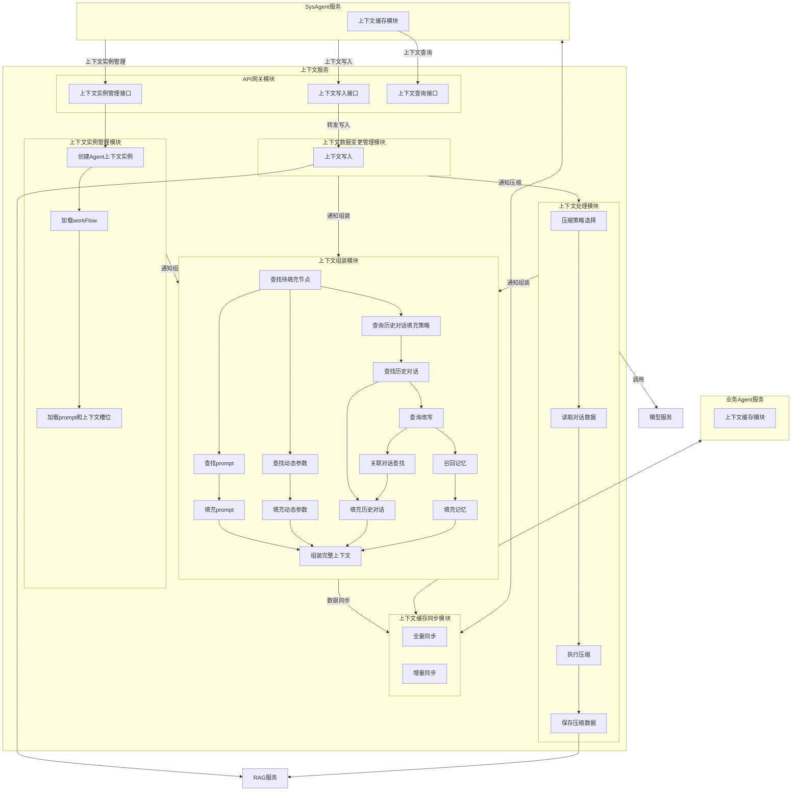
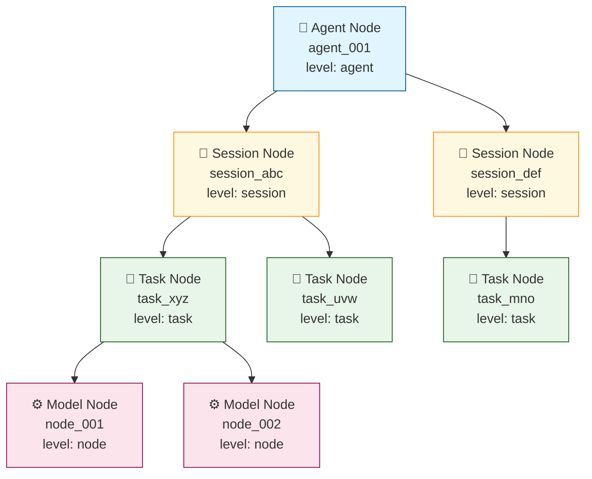
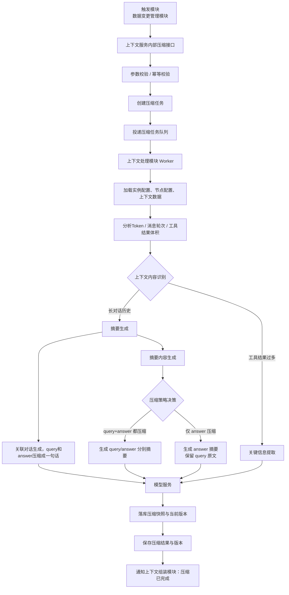

# 上下文服务设计文档

## 1. 概述

### 1.1 背景
上下文服务是 AI 系统的核心组件，负责管理 Agent 会话的上下文数据，包括上下文创建、存储、查询、压缩和同步等功能。

### 1.2 目标
- 提供统一的上下文管理能力，支持业务 Agent 和 SysAgent
- 实现高效的上下文缓存同步机制
- 支持上下文压缩，优化存储和传输
- 提供灵活的上下文组装能力

### 1.3 术语说明
| 术语 | 说明 |
|------|------|
| Agent | 智能体，包括业务 Agent 和 SysAgent |
| 上下文 | Agent 会话的历史记录、状态信息 |
| 上下文实例 | 特定 Agent 的上下文对象 |
| RAG | 检索增强生成服务（内置关系数据库） |

---

## 2. 架构设计

### 2.1 整体架构

```
┌─────────────────┐     ┌─────────────────┐
│  业务Agent服务   │     │   SysAgent服务   │
│  (上下文缓存)    │     │  (上下文缓存)    │
└────────┬────────┘     └────────┬────────┘
         │                       │
         │    ┌─────────────┐    │
         └────┤  上下文服务  ├────┘
              │  ContextSvc │
              └──────┬──────┘
                     │
                     ▼
            ┌─────────────────┐
            │   RAG服务        │
            │  (关系库+向量库)  │
            └─────────────────┘
```

### 2.2 模块划分

上下文服务包含以下核心模块：

| 模块 | 职责 |
|------|------|
| API网关模块 | 对外提供统一接口，包括实例管理、上下文写入、查询 |
| 上下文实例管理模块 | 管理 Agent 上下文实例的生命周期 |
| 上下文数据变更管理模块 | 处理上下文数据的变更和持久化 |
| 上下文处理模块 | 执行上下文压缩策略 |
| 上下文组装模块 | 组装完整上下文，供 LLM 使用 |
| 上下文缓存同步模块 | 与 Agent 端缓存进行双向同步 |

### 2.3 整体流程图



**流程说明**：

1. **SysAgent** 通过 API 网关调用上下文服务：
   - 调用「上下文实例管理接口」创建/更新/删除实例
   - 调用「上下文写入接口」写入会话数据

2. **上下文服务内部流转**：
   - 「上下文实例管理模块」创建实例后，通知「上下文组装模块」预装填
   - 「上下文数据变更管理模块」写入数据后，通知「上下文处理模块」压缩，同时通知「上下文组装模块」更新
   - 「上下文处理模块」压缩完成后，通知「上下文组装模块」重新组装
   - 「上下文组装模块」完成组装后，通过「上下文缓存同步模块」同步到 Agent

3. **外部依赖**：
   - **RAG服务**：用于数据持久化存储
   - **模型服务**：用于压缩时的摘要生成

4. **缓存同步**：
   - 「上下文缓存同步模块」与业务 Agent 和 SysAgent 进行双向全量/增量同步

---

### 2.4 推荐代码目录结构

基于 2.3 的整体流程图，代码目录建议按“接入层 -> 应用编排层 -> 领域能力层 -> 基础设施层”组织。这样可以保证调用链清晰，模块边界与流程图一致，同时便于后续拆分成独立服务或独立库。

```text
ContextEngine/
├── CMakeLists.txt
├── README.md
├── docs/
├── include/
│   ├── api/
│   │   ├── context_controller.h
│   │   ├── request_dto.h
│   │   └── response_dto.h
│   ├── application/
│   │   ├── instance/
│   │   │   └── instance_app_service.h
│   │   ├── write/
│   │   │   └── context_write_app_service.h
│   │   ├── query/
│   │   │   └── context_query_app_service.h
│   │   └── assemble/
│   │       └── context_assemble_app_service.h
│   ├── domain/
│   │   ├── model/
│   │   │   ├── context_instance.h
│   │   │   ├── context_message.h
│   │   │   └── context_snapshot.h
│   │   ├── instance/
│   │   │   └── instance_manager.h
│   │   ├── change/
│   │   │   └── data_change_manager.h
│   │   ├── processing/
│   │   │   ├── compression_service.h
│   │   │   └── compression_strategy.h
│   │   ├── assemble/
│   │   │   ├── context_assembler.h
│   │   │   ├── prompt_provider.h
│   │   │   └── memory_retriever.h
│   │   └── sync/
│   │       └── cache_sync_service.h
│   ├── infrastructure/
│   │   ├── persistence/
│   │   │   ├── context_repository.h
│   │   │   └── snapshot_repository.h
│   │   ├── llm/
│   │   │   └── llm_client.h
│   │   ├── rag/
│   │   │   └── rag_client.h
│   │   ├── workflow/
│   │   │   └── workflow_loader.h
│   │   ├── prompt/
│   │   │   └── prompt_loader.h
│   │   └── cache/
│   │       └── agent_cache_gateway.h
│   └── common/
│       ├── error_code.h
│       ├── result.h
│       └── types.h
├── src/
│   ├── api/
│   ├── application/
│   ├── domain/
│   ├── infrastructure/
│   └── common/
├── tests/
│   ├── unit/
│   ├── integration/
│   └── e2e/
└── examples/
```

**目录设计说明**：

| 目录 | 对应流程图模块 | 设计说明 |
|------|---------------|---------|
| `api/` | API 网关模块 | 对外暴露实例管理、写入、查询接口；只做协议适配、参数校验、鉴权与返回封装 |
| `application/instance` | 上下文实例管理模块 | 编排“创建实例 -> 加载 workflow -> 加载 prompt 和槽位”等流程，不承载底层存储细节 |
| `application/write` | 上下文数据变更管理模块 | 编排写入请求、触发持久化、通知压缩与组装刷新 |
| `application/query` | 查询入口 | 统一查询上下文、快照、组装结果，避免查询逻辑散落到 controller 或 repository |
| `application/assemble` | 上下文组装模块 | 编排 prompt、动态参数、历史会话、记忆召回等组装流程 |
| `domain/model` | 核心领域对象 | 沉淀实例、消息、快照、槽位等稳定业务模型 |
| `domain/instance` | 上下文实例管理模块 | 放领域规则，如实例生命周期、状态流转、初始化约束 |
| `domain/change` | 上下文数据变更管理模块 | 放写入校验、消息归档、版本推进等核心业务规则 |
| `domain/processing` | 上下文处理模块 | 放压缩策略选择、压缩执行、压缩结果校验等能力 |
| `domain/assemble` | 上下文组装模块 | 放组装规则、槽位填充规则、记忆与历史对话融合规则 |
| `domain/sync` | 上下文缓存同步模块 | 放全量/增量同步规则、冲突处理与同步状态管理 |
| `infrastructure/persistence` | RAG/存储依赖 | 负责上下文、快照、压缩结果等持久化实现 |
| `infrastructure/llm` | 模型服务 | 封装压缩、摘要、改写等 LLM 调用 |
| `infrastructure/rag` | RAG 服务 | 封装记忆检索、关联对话检索、向量查询等外部能力 |
| `infrastructure/workflow` | workflow 加载 | 隔离 workflow 配置来源，避免实例管理模块依赖具体配置介质 |
| `infrastructure/prompt` | prompt 加载 | 隔离 prompt 模板与上下文槽位配置来源 |
| `infrastructure/cache` | Agent / SysAgent 缓存同步 | 负责和外部缓存模块交互，屏蔽传输协议细节 |
| `common/` | 通用能力 | 放跨模块复用的错误码、返回结构、公共类型，避免污染领域层 |

**落地原则**：

1. `application` 只负责流程编排，不直接承载复杂业务规则，复杂规则应下沉到 `domain`。
2. `domain` 不依赖具体 LLM、RAG、缓存协议实现，外部依赖统一经 `infrastructure` 注入。
3. `api` 不直接操作 repository，而是只调用 `application`，保证入口层足够薄。
4. `src/` 与 `include/` 保持镜像结构，便于 C++ 项目维护头文件暴露边界。
5. `tests/unit` 主要覆盖 `domain`，`tests/integration` 覆盖 `application + infrastructure`，`tests/e2e` 覆盖整条流程链路。

---


## 3. 模块详细设计

### 3.1 API网关模块

**职责**：对外暴露统一的上下文服务接口，负责请求路由、协议转换、权限校验。

**接口列表**：

| 接口 | 功能 | 调用方 |
|------|------|--------|
| 上下文实例管理接口 | 创建/更新/删除上下文实例 | SysAgent |
| 上下文写入接口 | 写入会话数据 | SysAgent、业务Agent |
| 上下文查询接口 | 查询上下文数据 | SysAgent |

**数据流**：
```
SysAgent → 上下文写入接口 → 上下文数据变更管理模块 → RAG
```

**接口定义**：

**1. 创建上下文实例接口**

| 项目 | 说明 |
|------|------|
| **接口地址** | `POST /context/v1/instance/create` |
| **调用方** | SysAgent |
| **功能描述** | 创建新的上下文实例，初始化模型调用链和Prompt模板 |

**Request参数**：

| 参数名 | 类型 | 必填 | 说明 |
|--------|------|------|------|
| agent_id | string | 是 | Agent唯一标识 |
| session_id | string | 是 | 会话唯一标识 |
| task_id | string | 否 | 任务唯一标识，task级实例必填 |
| agenttype | string | 是 | Agent类型枚举：sys_agent, qa_agent, travel_agent, shopping_agent, movie_agent |

**Response参数**：

| 参数名 | 类型 | 说明 |
|--------|------|------|
| code | int | 状态码，0表示成功 |
| message | string | 状态描述 |
| data.instance_id | string | 实例唯一标识 |

**调用示例**：

```bash
curl -X POST http://localhost:8080/context/v1/instance/create \
  -H "Content-Type: application/json" \
  -H "X-API-Key: your-api-key" \
  -d '{
    "agent_id": "agent_001",
    "session_id": "session_abc123",
    "task_id": "task_xyz789",
    "agenttype": "qa_agent"
  }'
```

**响应示例**：

```json
{
  "code": 0,
  "message": "success",
  "data": {
    "instance_id": "inst_001"
  }
}
```

---

**2. 更新上下文实例接口**

| 项目 | 说明 |
|------|------|
| **接口地址** | `PUT /context/v1/instance/{instance_id}/update` |
| **调用方** | SysAgent |
| **功能描述** | 更新指定实例的参数和上下文数据 |

**Path参数**：

| 参数名 | 类型 | 说明 |
|--------|------|------|
| instance_id | string | 实例唯一标识 |

**Request参数**：

| 参数名 | 类型 | 必填 | 说明 |
|--------|------|------|------|
| params | object | 否 | 更新的参数值 |
| context_data | object | 否 | 更新的上下文数据 |

**Response参数**：

| 参数名 | 类型 | 说明 |
|--------|------|------|
| code | int | 状态码 |
| message | string | 状态描述 |
| data.instance_id | string | 实例唯一标识 |
| data.updated_at | string | 更新时间戳 |

**调用示例**：

```bash
curl -X PUT http://localhost:8080/context/v1/instance/inst_001/update \
  -H "Content-Type: application/json" \
  -H "X-API-Key: your-api-key" \
  -d '{
    "params": {
      "temperature": 0.8,
      "max_tokens": 2000
    },
    "context_data": {
      "user_preference": "concise"
    }
  }'
```

**响应示例**：

```json
{
  "code": 0,
  "message": "success",
  "data": {
    "instance_id": "inst_001",
    "updated_at": "2026-03-08T14:30:00Z"
  }
}
```

---

**3. 删除上下文实例接口**

| 项目 | 说明 |
|------|------|
| **接口地址** | `DELETE /context/v1/instance/{instance_id}` |
| **调用方** | SysAgent |
| **功能描述** | 删除指定上下文实例，释放资源 |

**Path参数**：

| 参数名 | 类型 | 说明 |
|--------|------|------|
| instance_id | string | 实例唯一标识 |

**Response参数**：

| 参数名 | 类型 | 说明 |
|--------|------|------|
| code | int | 状态码 |
| message | string | 状态描述 |

**调用示例**：

```bash
curl -X DELETE http://localhost:8080/context/v1/instance/inst_001 \
  -H "X-API-Key: your-api-key"
```

**响应示例**：

```json
{
  "code": 0,
  "message": "success"
}
```

---

**4. 上下文写入接口**

| 项目 | 说明 |
|------|------|
| **接口地址** | `POST /context/v1/write` |
| **调用方** | SysAgent、业务Agent |
| **功能描述** | 写入会话数据，触发后续处理和组装流程 |

**Request参数**：

| 参数名 | 类型 | 必填 | 说明 |
|--------|------|------|------|
| agent_id | string | 是 | Agent唯一标识 |
| session_id | string | 是 | 会话唯一标识 |
| task_id | string | 否 | 任务唯一标识 |
| messages | array | 否 | 对话消息列表 |
| tool_results | array | 否 | 工具调用结果列表 |
| dynamic_params | object | 否 | 动态参数键值对 |
| metadata | object | 否 | 元数据信息 |

**参数结构详情**：

```json
{
  "agent_id": "agent_001",
  "session_id": "session_abc123",
  "task_id": "task_xyz789",
  "messages": [
    {
      "role": "user",
      "content": "你好",
      "timestamp": "2026-03-08T10:00:00Z"
    },
    {
      "role": "assistant",
      "content": "您好！有什么可以帮助您的？",
      "timestamp": "2026-03-08T10:00:05Z"
    }
  ],
  "tool_results": [
    {
      "tool_id": "search_tool",
      "tool_name": "天气查询",
      "invocation_id": "inv_001",
      "status": "success",
      "input": {"city": "北京"},
      "output": {"temperature": 25, "weather": "晴"},
      "timestamp": "2026-03-08T10:00:10Z"
    }
  ],
  "dynamic_params": {
    "user_location": "北京",
    "preferred_language": "zh-CN"
  }
}
```

**Response参数**：

| 参数名 | 类型 | 说明 |
|--------|------|------|
| code | int | 状态码 |
| message | string | 状态描述 |
| data.context_id | string | 上下文数据标识 |

**调用示例**：

```bash
curl -X POST http://localhost:8080/context/v1/write \
  -H "Content-Type: application/json" \
  -H "X-API-Key: your-api-key" \
  -d '{
    "agent_id": "agent_001",
    "session_id": "session_abc123",
    "task_id": "task_xyz789",
    "messages": [
      {
        "role": "user",
        "content": "北京今天天气怎么样？",
        "timestamp": "2026-03-08T10:00:00Z"
      }
    ],
    "tool_results": [
      {
        "tool_id": "weather_query",
        "tool_name": "天气查询",
        "invocation_id": "inv_001",
        "status": "success",
        "input": {"city": "北京"},
        "output": {"temperature": 25, "weather": "晴", "humidity": 40},
        "timestamp": "2026-03-08T10:00:10Z"
      }
    ],
    "dynamic_params": {
      "user_location": "北京",
      "preferred_language": "zh-CN"
    },
    "metadata": {
      "source": "web",
      "version": "1.0"
    }
  }'
```

**响应示例**：

```json
{
  "code": 0,
  "message": "success",
  "data": {
    "context_id": "ctx_001"
  }
}
```

---

**5. 上下文查询接口**

| 项目 | 说明 |
|------|------|
| **接口地址** | `GET /context/v1/query` |
| **调用方** | SysAgent |
| **功能描述** | 查询指定Agent/Session的上下文数据 |

**Query参数**：

| 参数名 | 类型 | 必填 | 说明 |
|--------|------|------|------|
| agent_id | string | 是 | Agent唯一标识 |
| session_id | string | 是 | 会话唯一标识 |
| task_id | string | 否 | 任务唯一标识 |

**Response参数**：

| 参数名 | 类型 | 说明 |
|--------|------|------|
| code | int | 状态码 |
| message | string | 状态描述 |
| data.context.instance_id | string | 实例标识 |
| data.context.messages | array | 消息列表 |
| data.context.parameters | object | 参数值 |

**调用示例**：

```bash
curl -X GET "http://localhost:8080/context/v1/query?agent_id=agent_001&session_id=session_abc123&task_id=task_xyz789" \
  -H "X-API-Key: your-api-key"
```

**响应示例**：

```json
{
  "code": 0,
  "message": "success",
  "data": {
    "context": {
      "instance_id": "inst_001",
      "agent_id": "agent_001",
      "session_id": "session_abc123",
      "task_id": "task_xyz789",
      "messages": [
        {
          "role": "user",
          "content": "北京今天天气怎么样？",
          "timestamp": "2026-03-08T10:00:00Z"
        },
        {
          "role": "assistant",
          "content": "北京今天天气晴朗，气温25度。",
          "timestamp": "2026-03-08T10:00:15Z"
        }
      ],
      "parameters": {
        "temperature": 0.7,
        "max_tokens": 2000
      }
    }
  }
}
```

---

### 3.2 上下文实例管理模块

**职责**：管理上下文实例的创建、初始化、销毁。系统启动时预加载所有Agent配置，实例创建时快速绑定预置配置。

**预置配置说明**：

系统首次启动时会从本上下文服务的配置文件中加载并缓存以下预置数据，**同时为每个 Agent 在数据库中创建默认实例模板**。

**配置文件目录结构**：

```
/config
├── agents/                          # Agent配置文件目录
│   ├── sys_agent.yaml              # SysAgent配置
│   ├── qa_agent.yaml               # 问答Agent配置
│   ├── travel_agent.yaml           # 旅游Agent配置
│   ├── shopping_agent.yaml         # 购物Agent配置
│   └── movie_agent.yaml            # 电影Agent配置
├── templates/                       # Prompt模板目录
│   ├── system/                     # System Prompt模板
│   │   ├── intent_recognition_sys_v1.txt
│   │   └── answer_generation_sys_v1.txt
│   └── user/                       # User Prompt模板
│       ├── intent_recognition_user_v1.txt
│       └── answer_generation_user_v1.txt
└── global.yaml                     # 全局配置
```

**配置加载规则**：
- 服务启动时扫描 `/config/agents/` 目录下所有 `.yaml` 文件
- 每个 AgentType 对应一个独立的配置文件
- 配置文件名格式：`{agenttype}.yaml`
- 配置文件变更后需重启服务生效（或调用热更新接口）

**预置数据内容**：

| 预置数据 | 内容说明 | 配置时机 | 配置文件位置 |
|----------|----------|----------|--------------|
| **工作流配置** | Agent类型的标准执行流程、步骤依赖关系 | 系统启动时 | `/config/agents/{agenttype}.yaml` |
| **模型编排节点** | 模型调用顺序、策略、fallback配置、超时重试参数 | 系统启动时 | `/config/agents/{agenttype}.yaml` |
| **Prompt模板** | System Prompt、User Prompt、Model Specific Prompts | 系统启动时 | `/config/agents/{agenttype}.yaml` + `/config/templates/` |
| **槽位参数定义** | 输入参数、动态参数、输出参数的定义和校验规则 | 系统启动时 | `/config/agents/{agenttype}.yaml` |

**默认实例模板创建（服务启动时）**：

服务启动时，读取配置文件后，将配置内容解析并插入数据库 `context_template` 表作为默认模板：

```python
# 伪代码：服务启动时从配置文件加载并创建模板
config = load_yaml(f"/config/agents/{agenttype}.yaml")

# 1. 插入 Agent 模板
agent_template_id = f"agent_{agenttype}_template"
insert_context_template(
    id=agent_template_id,
    level="agent",
    agenttype=agenttype,
    agent_id=f"{agenttype}_template",
    version="1.0"
)

# 2. 插入 Session 模板
session_template_id = f"sess_{agenttype}_template"
insert_context_template(
    id=session_template_id,
    level="session",
    agenttype=agenttype,
    agent_id=f"{agenttype}_template",
    session_id="template",
    session_name="默认会话模板",
    version="1.0"
)

# 3. 插入 Task 模板
task_template_id = f"task_{agenttype}_template"
insert_context_template(
    id=task_template_id,
    level="task",
    agenttype=agenttype,
    agent_id=f"{agenttype}_template",
    session_id="template",
    task_id="template",
    task_type="default",
    task_name="默认任务模板",
    version="1.0"
)

# 4. 遍历 workflow nodes，插入 Node 模板
for node in config.workflow.nodes:
    node_template_id = f"node_task_{agenttype}_template_{node.node_id}"
    insert_context_template(
        id=node_template_id,
        level="node",
        agenttype=agenttype,
        agent_id=f"{agenttype}_template",
        session_id="template",
        task_id="template",
        node_order=node.order,
        node_type=node.node_type,
        model_config=json.dumps(node),  # 存储完整node配置
        system_prompt=node.system_prompt.content,
        user_prompt=node.user_prompt.content,
        version="1.0"
    )
```

**对应 SQL 语句**：

```sql
-- 插入 Agent 模板（从配置文件解析）
INSERT INTO context_template (id, level, agenttype, agent_id, version)
VALUES ('agent_{agenttype}_template', 'agent', '{agenttype}', '{agenttype}_template', '1.0');

-- 插入 Session 模板（从配置文件解析）
INSERT INTO context_template (id, level, agenttype, agent_id, session_id, session_name, version)
VALUES ('sess_{agenttype}_template', 'session', '{agenttype}', '{agenttype}_template', 'template', '默认会话模板', '1.0');

-- 插入 Task 模板（从配置文件解析）
INSERT INTO context_template (id, level, agenttype, agent_id, session_id, task_id, task_type, task_name, version)
VALUES ('task_{agenttype}_template', 'task', '{agenttype}', '{agenttype}_template', 'template', 'template', 'default', '默认任务模板', '1.0');

-- 基于 workflow.nodes 配置插入 Node 模板（从配置文件解析每个node）
INSERT INTO context_template (id, level, agenttype, agent_id, session_id, task_id,
    node_order, node_type, model_config, system_prompt, user_prompt, version)
VALUES ('node_task_{agenttype}_template_{node_id}', 'node', '{agenttype}', '{agenttype}_template',
    'template', 'template', {node.order}, '{node.node_type}',
    '{node_config_json}', '{node.system_prompt.content}', '{node.user_prompt.content}', '1.0');
```

**模板用途**：
- 作为新实例创建的**复制源**，避免每次从配置文件重新解析
- 缓存已渲染的 Prompt 模板和模型配置
- 加速实例创建流程（直接从模板表复制，而非配置文件解析）


**核心流程**：

```
接收请求 → 解析验证 → 绑定预置配置 → 构建实例 → 通知下游
```

**详细流程**：

```
接收请求 → 解析验证 → 加载预置配置 → 构建实例 → 持久化存储 → 通知下游
```

#### 步骤1：接收请求
- 接收实例创建/更新/删除请求
- 请求参数：
  | 参数名 | 类型 | 必填 | 说明 |
  |--------|------|------|------|
  | agent_id | string | 是 | Agent唯一标识 |
  | session_id | string | 是 | 会话唯一标识 |
  | task_id | string | 否 | 任务唯一标识（task级实例必填）|
  | agenttype | string | 是 | Agent类型枚举：sys_agent, qa_agent, travel_agent, shopping_agent, movie_agent |

#### 步骤2：解析验证
- 解析请求参数，提取 agent_id、session_id、task_id、agenttype
- 验证 agenttype 对应的预置配置是否已加载（检查内存中的配置缓存）
- 校验调用方权限（API Key 验证）
- 若 task_id 为空，创建 session 级实例；否则创建 task 级实例

#### 步骤3：加载预置配置
从本地配置文件加载对应 agenttype 的配置：

| 配置项 | 配置文件路径 | 说明 |
|--------|--------------|------|
| 模型编排配置 | `/config/agents/{agenttype}.yaml` | 模型调用链配置、路由规则 |
| Prompt模板库 | `/config/agents/{agenttype}.yaml` + `/config/templates/` | System Prompt、User Prompt、Model Specific Prompts |
| 参数定义 | `/config/agents/{agenttype}.yaml` | 输入参数、动态参数、输出参数定义 |
| WorkFlow配置 | `/config/agents/{agenttype}.yaml` | 工作流步骤、依赖关系 |
| 上下文槽位定义 | `/config/agents/{agenttype}.yaml` | session、memory、tool 槽位配置 |

**配置加载流程**：
1. 根据 `agenttype` 确定配置文件路径（如 `/config/agents/qa_agent.yaml`）
2. 从内存缓存中读取已加载的配置（服务启动时已预加载）
3. 若缓存未命中，实时读取配置文件并解析
4. 将配置内容绑定到当前实例构建上下文

#### 步骤4：基于默认模板创建实例记录
上下文服务启动时，已为每个 Agent 在数据库中创建了**默认实例模板**。收到创建实例请求后，基于该模板复制出新的实例记录：

**默认实例模板结构（创建时参考）**：
```
默认Agent模板 (level=agent, id=agent_{agenttype}_template)
├── 默认Session模板 (level=session)
│   └── 默认Task模板 (level=task)
│       ├── Node模板-意图识别 (level=node)
│       └── Node模板-答案生成 (level=node)
```

**4.1 复制 Agent 层级记录**
基于默认模板，插入新的 Agent 实例记录：

```sql
INSERT INTO context_instance (
    id, level, agenttype, agent_id, current_session_id, status, template_id, template_version, created_at, updated_at
)
SELECT
    'agent_{agent_id}',              -- 新生成的Agent实例ID
    'agent',
    agenttype,
    '{agent_id}',                    -- 请求中的agent_id
    'sess_{agent_id}_{session_id}',  -- 新session ID
    'active',
    id,                              -- 来源模板ID
    version,                         -- 来源模板版本
    NOW(), NOW()
FROM context_template
WHERE id = 'agent_{agenttype}_template' AND level = 'agent';
```

**4.2 复制 Session 层级记录**
基于默认模板，插入新的 Session 实例记录：

```sql
INSERT INTO context_instance (
    id, level, agent_id, session_id, session_name, status, template_id, template_version, created_at, updated_at
)
SELECT
    'sess_{agent_id}_{session_id}',  -- 新生成的Session ID
    'session',
    '{agent_id}',
    '{session_id}',                  -- 请求中的session_id
    COALESCE(NULLIF('{session_name}', ''), session_name, '新会话'),
    'active',
    id,
    version,
    NOW(), NOW()
FROM context_template
WHERE agenttype = '{agenttype}' AND level = 'session' AND session_id = 'template';
```

**4.3 复制 Task 层级记录**
基于默认模板，插入新的 Task 实例记录：

```sql
INSERT INTO context_instance (
    id, level, agent_id, session_id, task_id, task_type, task_name, status, template_id, template_version, created_at, updated_at
)
SELECT
    'task_{agent_id}_{session_id}_{task_id}',  -- 新生成的Task ID
    'task',
    '{agent_id}',
    '{session_id}',
    COALESCE('{task_id}', 'task_default'),     -- 请求中的task_id或默认值
    task_type,
    task_name,
    'active',
    id,
    version,
    NOW(), NOW()
FROM context_template
WHERE agenttype = '{agenttype}' AND level = 'task' AND task_id = 'template';
```

**4.4 复制 Node 层级记录**
基于默认模板中的 nodes 配置，批量复制 Node 实例记录：

```sql
INSERT INTO context_instance (
    id, level, agent_id, session_id, task_id,
    node_order, node_type, model_config,
    system_prompt, user_prompt, status, template_id, template_version, created_at, updated_at
)
SELECT
    'node_task_{agent_id}_{session_id}_{task_id}_' || SUBSTRING_INDEX(id, '_', -1),  -- 从模板ID提取node_id
    'node',
    '{agent_id}',
    '{session_id}',
    COALESCE('{task_id}', 'task_default'),
    node_order,
    node_type,
    model_config,           -- 复制完整的模型配置（含context_requirements等）
    system_prompt,          -- 复制System Prompt模板
    user_prompt,            -- 复制User Prompt模板
    'pending',              -- 初始状态
    id,                     -- 来源模板ID
    version,                -- 来源模板版本
    NOW(), NOW()
FROM context_template
WHERE agenttype = '{agenttype}' AND level = 'node' AND task_id = 'template';
```

**复制时的字段映射规则**：

| 模板字段 | 新实例字段 | 处理方式 |
|----------|------------|----------|
| 模板ID | 新实例ID | 替换为 `{agent_id}_{session_id}_{task_id}` 格式 |
| agenttype | agenttype | 保持不变 |
| agent_id | agent_id | 使用请求中的 agent_id |
| session_id | session_id | 使用请求中的 session_id |
| task_id | task_id | 使用请求中的 task_id 或生成默认值 |
| system_prompt | system_prompt | 复制模板内容（支持变量渲染） |
| user_prompt | user_prompt | 复制模板内容 |
| model_config | model_config | 完整复制（含workflow、槽位定义等） |
| status | status | 重置为 active/pending |

**4.5 初始化实例参数槽位**
从模板的槽位定义初始化空值：

```json
{
  "parameter_values": {
    "input": {},           -- 等待用户请求填充
    "dynamic": {},         -- 运行时动态计算
    "output": {}           -- 模型执行后填充
  },
  "context_slots": {
    "session_context": {"status": "empty", "data": {}, "token_count": 0},
    "memory_context": {"status": "empty", "data": {}, "retrieved_memories": []},
    "tool_context": {"status": "empty", "data": {}}
  },
  "template_reference": "agent_{agenttype}_template"  -- 记录模板来源
}
```

#### 步骤5：通知下游
实例创建完成后，通知相关模块进行后续处理：

- **通知上下文组装模块**：触发预装填流程（加载session上下文、召回记忆）

**数据模型**：

**AgentConfig（完整Agent配置模型）**

```json
{
  "agenttype": "qa_agent",
  "version": "1.0",

  "workflow": {
    "workflow_id": "wf_qa_v1",
    "name": "问答Agent工作流",
    "description": "标准问答流程：意图识别 -> 答案生成",

    "nodes": [
      {
        "node_id": "intent_recognition",
        "node_type": "model",
        "name": "意图识别",
        "description": "分析用户query，识别意图和槽位",
        "order": 1,

        "system_prompt": {
          "template_id": "intent_recognition_sys_v1",
          "content": "你是一个专业的意图识别助手。请分析用户的输入，识别出用户的意图和关键槽位信息。\n\n注意事项：\n1. 意图分类必须在预定义的分类列表中\n2. 槽位提取要准确，缺失的槽位标记为null\n3. 返回格式必须是合法的JSON",
          "variables": []
        },

        "user_prompt": {
          "template_id": "intent_recognition_user_v1",
          "content": "用户输入：{{user_original_query}}\n\n请识别用户意图并提取槽位，以JSON格式返回：\n{\n  \"intent\": \"意图分类\",\n  \"slots\": {\n    \"槽位名\": \"槽位值\"\n  },\n  \"confidence\": 0.95\n}",
          "variables": ["user_original_query"]
        },

        "context_requirements": {
          "required_slots": [
            {
              "slot_id": "user_original_query",
              "slot_type": "input",
              "description": "用户原始query",
              "fill_strategy": "direct_input",
              "data_type": "string",
              "required": true
            },
            {
              "slot_id": "user_rewritten_query",
              "slot_type": "dynamic",
              "description": "改写后的query",
              "fill_strategy": "preprocess",
              "depends_on": ["user_original_query"],
              "data_type": "string",
              "required": false
            }
          ],
          "history_messages": {
            "enabled": true,
            "max_turns": 3,
            "max_tokens": 3000,
            "filter_strategy": "relevance",
            "relevance_threshold": 0.7
          },
          "memory_context": {
            "enabled": false
          }
        },

        "input_mapping": {
          "query": "{{user_rewritten_query}}",
          "history_messages": "{{history_messages}}"
        },

        "next_nodes": {
          "default": "answer_generation"
        }
      },
      {
        "node_id": "answer_generation",
        "node_type": "model",
        "name": "答案生成",
        "description": "基于上下文生成最终答案",
        "order": 2,
        "dependencies": ["intent_recognition"],

        "system_prompt": {
          "template_id": "answer_generation_sys_v1",
          "content": "你是一个专业的问答助手。基于用户的原始问题、识别出的意图和相关上下文信息，生成准确、有帮助的回答。\n\n回答要求：\n1. 回答要直接针对用户的问题\n2. 可以引用提供的历史对话和记忆信息\n3. 如果不确定，请诚实说明\n4. 保持友好、专业的语气",
          "variables": ["intent", "memories"]
        },

        "user_prompt": {
          "template_id": "answer_generation_user_v1",
          "content": "用户问题：{{user_original_query}}\n\n识别意图：{{intent}}\n\n\n相关记忆：\n{{memories}}\n\n\n\n历史对话：\n{{history_messages}}\n\n\n请根据以上信息生成回答：",
          "variables": ["user_original_query", "intent", "memories", "history_messages"]
        },

        "context_requirements": {
          "required_slots": [
            {
              "slot_id": "user_original_query",
              "slot_type": "input",
              "description": "展示给用户看的问题",
              "data_type": "string",
              "required": true
            },
            {
              "slot_id": "intent",
              "slot_type": "upstream_output",
              "source_node": "intent_recognition",
              "source_field": "intent",
              "data_type": "string",
              "required": true
            }
          ],
          "history_messages": {
            "enabled": true,
            "max_turns": 5,
            "filter_strategy": "sequential"
          },
          "memory_context": {
            "enabled": true,
            "retrieval_count": 2,
            "semantic_search": true
          }
        },

        "input_mapping": {
          "question": "{{user_original_query}}",
          "intent": "{{intent}}",
          "history": "{{history_messages}}",
          "memories": "{{memory_context}}"
        },

        "next_nodes": {
          "default": null
        }
      }
    ],

    "global_context": {
      "available_slots": [
        {
          "slot_id": "user_original_query",
          "slot_type": "input",
          "data_type": "string",
          "required": true,
          "description": "用户输入的原始query"
        },
        {
          "slot_id": "user_rewritten_query",
          "slot_type": "dynamic",
          "data_type": "string",
          "required": false,
          "default_value": null,
          "description": "改写优化后的query"
        },
        {
          "slot_id": "session_id",
          "slot_type": "meta",
          "data_type": "string",
          "required": true,
          "description": "会话唯一标识"
        },
        {
          "slot_id": "user_id",
          "slot_type": "meta",
          "data_type": "string",
          "required": false,
          "description": "用户唯一标识"
        }
      ],

    "error_handling": {
      "on_node_failure": {
        "strategy": "fallback",
        "fallback_node": null,
        "max_failures": 3
      },
      "on_timeout": {
        "strategy": "retry",
        "max_retries": 2
      }
    }
  }
}
```

**配置模型说明**

| 配置项 | 说明 |
|--------|------|
| `agenttype` | Agent类型标识，如 qa_agent、travel_agent |
| `version` | 配置版本号，用于配置更新管理 |
| `workflow` | 工作流定义，包含节点列表、全局上下文、错误处理 |
| `workflow.nodes` | 节点配置列表，每个节点包含模型配置、上下文需求、路由规则、Prompt配置 |
| `workflow.nodes[].system_prompt` | 节点的System Prompt配置，包含模板ID、内容、变量 |
| `workflow.nodes[].user_prompt` | 节点的User Prompt配置，包含模板ID、内容、变量，支持条件渲染 |
| `workflow.global_context` | 全局槽位定义和可见性策略 |
| `workflow.error_handling` | 节点失败和超时时的处理策略 |


**ContextRequirement说明**

上下文需求配置定义了节点执行所需的上下文数据：
- `required_slots`：必需槽位列表，包含输入参数、动态参数、上游节点输出
- `history_messages`：历史对话消息配置（轮数、过滤策略）
- `session_context`：会话级上下文字段
- `memory_context`：记忆召回配置

**Slot类型说明**

| 类型 | 来源 | 说明 |
|------|------|------|
| `input` | 用户输入 | 直接从请求中获取的参数 |
| `dynamic` | 预处理 | 通过预处理逻辑生成的参数 |
| `upstream_output` | 上游节点 | 依赖节点的输出结果 |
| `meta` | 元数据 | 会话ID、用户ID等元信息 |


#### AgentConfig 核心字段

| 字段名 | 说明 | 使用模块 |
|--------|------|----------|
| agenttype | Agent类型标识 | 实例管理 |
| version | 配置版本号 | 实例管理 |
| workflow | 工作流配置 | 实例管理 |
| workflow.nodes | 节点配置列表，每个节点包含Prompt配置、上下文需求、路由规则 | 实例管理 |
| workflow.nodes[].system_prompt | 节点的System Prompt配置 | 实例管理、组装 |
| workflow.nodes[].user_prompt | 节点的User Prompt配置 | 实例管理、组装 |
| workflow.global_context | 全局槽位定义和可见性策略 | 实例管理 |
| workflow.error_handling | 节点失败和超时时的处理策略 | 实例管理 |


**数据存储设计**

上下文数据采用双表设计分离存储：**模板表**（context_template）存储配置元数据，**实例表**（context_instance）存储运行时数据。

### 双表设计

```
┌─────────────────────────────────────────────────────────────┐
│  context_template（模板表）                                  │
│  - 存储Agent配置模板（每个AgentType一套）                    │
│  - 数据量小，相对稳定                                        │
│  - 服务启动时从配置文件加载                                  │
└─────────────────────────────────────────────────────────────┘
                             │
                             │ 复制
                             ▼
┌─────────────────────────────────────────────────────────────┐
│  context_instance（实例表）                                  │
│  - 存储运行时实例数据（每个请求创建一套）                    │
│  - 数据量大，动态增长                                        │
│  - 可独立分库分表                                            │
└─────────────────────────────────────────────────────────────┘
```

#### 模板表（context_template）

存储从配置文件解析的默认模板，作为实例创建的复制源：

```sql
-- =============================================
-- 上下文模板表
-- 存储从配置文件加载的默认模板
-- =============================================
CREATE TABLE context_template (
    -- 主键和层级标识
    id                  VARCHAR(64) PRIMARY KEY COMMENT '模板唯一标识',
    level               VARCHAR(16) NOT NULL COMMENT '层级: agent/session/task/node',
    agenttype           VARCHAR(32) NOT NULL COMMENT 'Agent类型',

    -- 各层级的标识（模板使用固定标识）
    agent_id            VARCHAR(64) COMMENT '模板Agent标识（固定值）',
    session_id          VARCHAR(64) COMMENT '模板Session标识（固定值）',
    task_id             VARCHAR(64) COMMENT '模板Task标识（固定值）',
    node_order          INT COMMENT '执行顺序（仅node层级）',

    -- 层级特定字段
    session_name        VARCHAR(256) COMMENT '会话名称模板',
    task_type           VARCHAR(32) COMMENT '任务类型',
    task_name           VARCHAR(256) COMMENT '任务名称模板',
    node_type           VARCHAR(32) DEFAULT 'llm' COMMENT '节点类型',

    -- 配置内容（核心字段）
    model_config        JSON COMMENT '模型配置（含workflow、context_requirements等）',
    system_prompt       TEXT COMMENT '系统提示词模板',
    user_prompt         TEXT COMMENT '用户提示词模板',

    -- 版本管理
    version             VARCHAR(32) DEFAULT '1.0' COMMENT '配置版本号',

    -- 时间戳
    created_at          TIMESTAMP DEFAULT CURRENT_TIMESTAMP,
    updated_at          TIMESTAMP DEFAULT CURRENT_TIMESTAMP ON UPDATE CURRENT_TIMESTAMP,

    -- 索引
    INDEX idx_level (level),
    INDEX idx_agenttype (agenttype),
    INDEX idx_level_agenttype (level, agenttype),
    INDEX idx_version (version)
) COMMENT='上下文模板表';
```

#### 实例表（context_instance）

存储运行时创建的实例数据，字段与模板表类似但增加运行时字段：

```sql
-- =============================================
-- 上下文实例表
-- 存储从模板复制生成的运行时实例
-- =============================================
CREATE TABLE context_instance (
    -- 主键和层级标识
    id                  VARCHAR(64) PRIMARY KEY COMMENT '实例唯一标识',
    level               VARCHAR(16) NOT NULL COMMENT '层级: agent/session/task/node',
    agenttype           VARCHAR(32) COMMENT 'Agent类型',

    -- 各层级的业务标识（运行时真实值）
    agent_id            VARCHAR(64) COMMENT '所属Agent ID',
    session_id          VARCHAR(64) COMMENT '所属Session ID',
    task_id             VARCHAR(64) COMMENT '所属Task ID',
    node_order          INT COMMENT '执行顺序（仅node层级）',

    -- 通用状态
    status              VARCHAR(16) DEFAULT 'active' COMMENT '状态',

    -- ===== Agent层级字段 =====
    current_session_id  VARCHAR(64) COMMENT '当前活跃会话ID（仅agent层级）',

    -- ===== Session层级字段 =====
    session_name        VARCHAR(256) COMMENT '会话名称（实际值）',

    -- ===== Task层级字段 =====
    task_type           VARCHAR(32) COMMENT '任务类型',
    task_name           VARCHAR(256) COMMENT '任务名称（实际值）',

    -- ===== Model Node层级字段 =====
    node_type           VARCHAR(32) DEFAULT 'llm' COMMENT '节点类型',
    model_config        JSON COMMENT '模型配置（从模板复制）',

    -- Token消耗
    total_tokens        INT DEFAULT 0 COMMENT '总Token数',

    -- ===== 上下文内容（仅node层级） =====
    system_prompt       TEXT COMMENT '系统提示词（渲染后）',
    user_prompt         TEXT COMMENT '用户提示词模板',
    user_message        TEXT COMMENT '用户原始消息',
    user_original_query TEXT COMMENT '用户原始query',
    user_rewritten_query TEXT COMMENT '用户改写后query',
    input_messages      JSON COMMENT '输入消息列表',
    tool_results        JSON COMMENT '工具调用结果',
    dynamic_params      JSON COMMENT '动态参数值',

    -- 关联模板（用于追溯和更新）
    template_id         VARCHAR(64) COMMENT '来源模板ID',
    template_version    VARCHAR(32) COMMENT '来源模板版本',

    -- 时间戳
    created_at          TIMESTAMP DEFAULT CURRENT_TIMESTAMP,
    updated_at          TIMESTAMP DEFAULT CURRENT_TIMESTAMP ON UPDATE CURRENT_TIMESTAMP,
    started_at          TIMESTAMP COMMENT '开始执行时间',
    completed_at        TIMESTAMP COMMENT '完成时间',

    -- 索引
    INDEX idx_level (level),
    INDEX idx_agent_id (agent_id),
    INDEX idx_session_id (session_id),
    INDEX idx_task_id (task_id),
    INDEX idx_agenttype (agenttype),
    INDEX idx_status (status),
    INDEX idx_template_id (template_id),
    INDEX idx_created_at (created_at),
    INDEX idx_level_agent (level, agent_id),
    INDEX idx_level_session (level, session_id),
    INDEX idx_level_task (level, task_id)
) COMMENT='上下文实例表';
```

#### context_template 表字段说明

| 字段名 | 类型 | 说明 | 使用模块 |
|--------|------|------|----------|
| id | VARCHAR(64) | 模板唯一标识 | 实例管理 |
| level | VARCHAR(16) | 层级: agent/session/task/node | 实例管理 |
| agenttype | VARCHAR(32) | Agent类型 | 实例管理 |
| agent_id | VARCHAR(64) | 模板Agent标识（固定值） | 实例管理 |
| session_id | VARCHAR(64) | 模板Session标识（固定值） | 实例管理 |
| task_id | VARCHAR(64) | 模板Task标识（固定值） | 实例管理 |
| node_order | INT | 执行顺序（仅node层级） | 实例管理 |
| session_name | VARCHAR(256) | 会话名称模板 | 实例管理 |
| task_type | VARCHAR(32) | 任务类型 | 实例管理 |
| task_name | VARCHAR(256) | 任务名称模板 | 实例管理 |
| node_type | VARCHAR(32) | 节点类型 | 实例管理 |
| model_config | JSON | 模型配置（含workflow、context_requirements等） | 实例管理、处理、组装 |
| system_prompt | TEXT | 系统提示词模板 | 实例管理、组装 |
| user_prompt | TEXT | 用户提示词模板 | 实例管理、组装 |
| version | VARCHAR(32) | 配置版本号 | 实例管理 |
| created_at | TIMESTAMP | 创建时间 | 实例管理 |
| updated_at | TIMESTAMP | 更新时间 | 实例管理 |

#### context_instance 表字段说明

| 字段名 | 类型 | 说明 | 使用模块 |
|--------|------|------|----------|
| id | VARCHAR(64) | 实例唯一标识 | 所有模块 |
| level | VARCHAR(16) | 层级: agent/session/task/node | 实例管理 |
| agenttype | VARCHAR(32) | Agent类型 | 实例管理 |
| agent_id | VARCHAR(64) | 所属Agent ID（运行时真实值） | 所有模块 |
| session_id | VARCHAR(64) | 所属Session ID（运行时真实值） | 所有模块 |
| task_id | VARCHAR(64) | 所属Task ID（运行时真实值） | 实例管理、数据变更 |
| node_order | INT | 执行顺序（仅node层级） | 实例管理 |
| status | VARCHAR(16) | 状态 | 所有模块 |
| current_session_id | VARCHAR(64) | 当前活跃会话ID（仅agent层级） | 实例管理 |
| session_name | VARCHAR(256) | 会话名称（实际值） | 实例管理 |
| task_type | VARCHAR(32) | 任务类型 | 实例管理 |
| task_name | VARCHAR(256) | 任务名称（实际值） | 实例管理 |
| node_type | VARCHAR(32) | 节点类型 | 实例管理 |
| model_config | JSON | 模型配置（从模板复制） | 实例管理、处理、组装 |
| total_tokens | INT | 总Token数 | 数据变更、处理 |
| system_prompt | TEXT | 系统提示词（从模板复制） | 实例管理、组装 |
| user_prompt | TEXT | 用户提示词模板（从模板复制） | 实例管理、组装 |
| user_message | TEXT | 用户原始消息 | 数据变更 |
| user_original_query | TEXT | 用户原始query | 数据变更、组装 |
| user_rewritten_query | TEXT | 用户改写后query | 数据变更、组装 |
| input_messages | JSON | 输入消息列表 | 数据变更、处理、组装 |
| tool_results | JSON | 工具调用结果 | 数据变更、处理、组装 |
| dynamic_params | JSON | 动态参数值 | 数据变更、组装、缓存 |
| template_id | VARCHAR(64) | 来源模板ID | 实例管理 |
| template_version | VARCHAR(32) | 来源模板版本 | 实例管理 |
| created_at | TIMESTAMP | 创建时间 | 所有模块 |
| updated_at | TIMESTAMP | 更新时间 | 所有模块 |
| started_at | TIMESTAMP | 开始执行时间 | 实例管理 |
| completed_at | TIMESTAMP | 完成时间 | 实例管理 |

### 层级关系示例

| id | level | parent_id | root_id | path | 说明 |
|----|-------|-----------|---------|------|------|
| agent_001 | agent | null | agent_001 | agent_001 | Agent根节点 |
| session_abc | session | agent_001 | agent_001 | agent_001/session_abc | Session节点 |
| task_xyz | task | session_abc | agent_001 | agent_001/session_abc/task_xyz | Task节点 |
| node_001 | node | task_xyz | agent_001 | agent_001/session_abc/task_xyz/node_001 | Model Node |

### 树形结构可视化



### 存储策略

| 功能 | 实现方式 | 说明 |
|------|----------|------|
| 关系查询 | RAG内置关系数据库 | 通过 `level` + `parent_id` 查询层级 |

**查询示例**：

```sql
-- 查询Agent下的所有Session
SELECT * FROM context_instance
WHERE level = 'session' AND parent_id = 'agent_001';

-- 查询Session下的所有Task
SELECT * FROM context_instance
WHERE level = 'task' AND session_id = 'session_abc';

-- 查询Task下的所有Node，按执行顺序排序
SELECT * FROM context_instance
WHERE level = 'node' AND task_id = 'task_xyz'
ORDER BY node_order;
```

---

### 3.3 上下文数据变更管理模块

**职责**：接收 API 网关模块发送的上下文数据变更请求，自动识别数据类型并持久化到 RAG 服务的 `context_instance` 表，同时建立 agent_id、session、task 的层级关系，最后通知上下文组装模块哪些信息发生了变更。

**模块关系**：
- **输入**：接收来自 API 网关模块的内部调用（非 REST 接口）
- **处理**：根据数据内容自动识别操作类型（创建/追加/合并/替换），无需外部指定
- **输出**：更新 `context_instance` 表，记录层级关系，向上下文组装模块发送变更通知

---

### 3.3.1 接收数据变更请求

API 网关模块将解析后的数据变更请求发送给本模块，数据变更管理模块不感知操作类型，仅根据数据内容自动处理。

**核心设计原则**：
- 外部不感知 `node` 概念，只传递业务数据（query、answer、工具结果、动态参数等）
- 数据变更模块根据 `agenttype` 和当前 Task 的配置，决定数据写入哪个 Node
- 支持同时写入多个 Node（如动态参数需要同步到多个 Node）

**输入数据结构**：

```json
{
  "change_id": "chg_20240308103000001",
  "timestamp": "2026-03-08T10:30:00.000Z",
  "source": "api_gateway",
  "agent_id": "agent_001",
  "data": {
    "session": {
      "session_id": "sess_agent_001_abc123",
      "session_name": "新会话"
    },
    "task": {
      "task_id": "task_agent_001_xyz789",
      "task_name": "问答任务",
      "task_type": "qa"
    },
    "context": {
      "user_original_query": "今天天气怎么样？",
      "user_message": "今天天气怎么样？",
      "input_messages": [
        {"role": "user", "content": "今天天气怎么样？", "timestamp": "2026-03-08T10:30:00Z"}
      ],
      "assistant_answer": "今天北京天气晴朗，25度",
      "tool_results": [
        {"tool_id": "weather_api", "status": "success", "output": {"temp": 25, "condition": "sunny"}}
      ],
      "dynamic_params": {
        "location": "北京",
        "intent": "weather_query",
        "temperature": 25
      }
    }
  }
}
```

**数据字段说明**：

| 字段 | 类型 | 说明 | 自动写入目标 |
|------|------|------|-------------|
| `user_original_query` | string | 用户原始查询 | 当前 Task 下所有 Node 的 `user_original_query` |
| `user_message` | string | 用户消息内容 | 当前 Task 下所有 Node 的 `user_message` |
| `input_messages` | array | 对话消息列表 | 当前 Task 下所有 Node 的 `input_messages`（追加）|
| `assistant_answer` | string | 助手回复内容 | 当前 Task 下已完成 Node 的 answer 字段 |
| `tool_results` | array | 工具调用结果 | 当前 Task 下依赖工具结果的 Node |
| `dynamic_params` | object | 动态参数/槽位 | 根据 `context_requirements` 路由到对应 Node |

**注**：数据变更模块首先检查 `agent_id` 是否存在，若不存在则自动从模板创建Agent实例，然后依次创建 session、task、node。

---

### 3.3.2 Agent实例检查与自动创建

在接收数据变更请求后，首先需要检查指定的 `agent_id` 是否已存在。若不存在，则自动从 `context_template` 复制创建Agent实例记录。

#### 步骤1：检查Agent实例是否存在

```sql
-- 查询指定Agent实例
SELECT id, agenttype, status
FROM context_instance
WHERE agent_id = ? AND level = 'agent';
```

#### 步骤2：自动创建Agent实例（如不存在）

如果Agent实例不存在，则需要：

**2.1 获取AgentType映射**

首先需要通过`agent_id`获取对应的`agenttype`。映射规则可以是：
- 从`agent_id`前缀解析（如 `weather_agent_001` → `weather_agent`）
- 或从请求中携带`agenttype`字段

```json
{
  "change_id": "chg_20240308103000001",
  "agent_id": "agent_001",
  "agenttype": "qa_agent",  // 新增：指定Agent类型
  "data": { ... }
}
```

**2.2 从模板复制创建Agent实例**

```sql
-- 从模板复制创建新Agent实例
INSERT INTO context_instance (
    id, level, agenttype, agent_id, current_session_id, status,
    template_id, template_version, created_at, updated_at
)
SELECT
    'agent_{agent_id}',              -- 新生成的Agent实例ID
    'agent',
    agenttype,
    '{agent_id}',                    -- 请求中的agent_id
    NULL,                            -- 当前活跃会话ID，稍后创建
    'active',
    id,                              -- 来源模板ID
    version,                         -- 来源模板版本
    NOW(), NOW()
FROM context_template
WHERE id = 'agent_{agenttype}_template' AND level = 'agent';
```

**2.3 创建默认Session和Task模板**

同时创建该Agent的默认Session和Task模板，作为后续动态创建的基础：

```sql
-- 创建默认Session模板（标记为template，供后续复制使用）
INSERT INTO context_instance (
    id, level, agenttype, agent_id, session_id, session_name,
    status, template_id, template_version, created_at, updated_at
)
SELECT
    CONCAT('sess_{agent_id}_template'),
    'session',
    agenttype,
    '{agent_id}',
    'template',
    '默认会话模板',
    'template',                      -- 标记为模板状态
    id,
    version,
    NOW(), NOW()
FROM context_template
WHERE agenttype = '{agenttype}' AND level = 'session' AND session_id = 'template';

-- 创建默认Task模板
INSERT INTO context_instance (
    id, level, agenttype, agent_id, session_id, task_id,
    task_name, task_type, status, template_id, template_version,
    created_at, updated_at
)
SELECT
    CONCAT('task_{agent_id}_template'),
    'task',
    agenttype,
    '{agent_id}',
    'template',                      -- 关联到默认Session模板
    'template',
    '默认任务模板',
    'default',
    'template',                      -- 标记为模板状态
    id,
    version,
    NOW(), NOW()
FROM context_template
WHERE agenttype = '{agenttype}' AND level = 'task' AND task_id = 'template';
```

#### Agent实例创建流程图

```
接收数据变更请求
    ↓
提取 agent_id 和 agenttype
    ↓
查询Agent实例是否存在？
    ↓
    ├─ 存在 → 继续后续流程
    ↓
    └─ 不存在
         ↓
    从context_template查询对应agenttype模板
         ↓
    复制模板创建Agent实例记录
         ↓
    创建默认Session模板
         ↓
    创建默认Task模板
         ↓
    继续后续流程
```

#### 注意事项

1. **并发控制**：多个请求同时创建同一Agent时，使用数据库唯一索引防止重复创建
2. **模板版本**：创建的实例记录`template_version`，用于后续追踪
3. **默认值**：`current_session_id`初始为空，在创建第一个Session时更新
4. **错误处理**：如果模板不存在（未定义的agenttype），返回明确错误信息

---

### 3.3.3 自动识别操作类型

数据变更模块根据以下规则自动识别如何处理数据：

| 判断条件 | 自动识别为 | 处理逻辑 |
|----------|-----------|----------|
| 记录不存在（按层级标识查询） | **CREATE** | 从 `context_template` 复制创建新记录 |
| 字段为数组类型（input_messages, tool_results） | **APPEND** | 将新数据追加到数组尾部 |
| 字段为对象类型（dynamic_params） | **MERGE** | 新旧对象合并，新值覆盖旧值 |
| 字段为标量类型（session_name, status 等） | **REPLACE** | 直接替换旧值 |

**操作识别伪代码**：

```python
def auto_detect_operation(existing_record, field_name, new_value):
    """根据字段类型和现有记录自动识别操作类型"""

    # 1. 检查记录是否存在
    if existing_record is None:
        return 'CREATE'

    # 2. 根据字段类型决定操作
    if field_name in ['input_messages', 'tool_results']:
        # 数组类型 -> 追加
        return 'APPEND'
    elif field_name == 'dynamic_params':
        # 对象类型 -> 合并
        return 'MERGE'
    else:
        # 标量类型 -> 替换
        return 'REPLACE'

def process_field(existing_value, new_value, operation):
    """根据操作类型处理字段值"""

    if operation == 'APPEND':
        # 数组追加
        if existing_value is None:
            return new_value
        return existing_value + new_value

    elif operation == 'MERGE':
        # 对象合并
        if existing_value is None:
            return new_value
        return {**existing_value, **new_value}

    elif operation == 'REPLACE':
        # 直接替换
        return new_value

    return new_value
```

---

### 3.3.4 层级关系记录与处理流程

数据变更模块自动维护四级层级关系，确保数据一致性。

**完整处理流程**（包含Agent自动创建）：

```
接收网关数据
    ↓
检查Agent实例是否存在
    ↓
    ├─ 不存在 → 从模板复制创建Agent实例
    ↓
按层级顺序处理（Session → Task → Node）
    ↓
查询是否存在（自动识别 CREATE or UPDATE）
    ↓
执行持久化（INSERT or UPDATE）
    ↓
记录层级关系变更
    ↓
发布变更通知
```

#### 步骤1：Session 处理

**1.1 查询 Session 是否存在**

```sql
-- 查询指定 Session 是否已存在
SELECT id, session_name, status, created_at
FROM context_instance
WHERE agent_id = ? AND session_id = ? AND level = 'session';
```

**1.2 不存在则创建（自动识别为 CREATE）**

```sql
-- 从模板复制创建新 Session
INSERT INTO context_instance (
    id, level, agenttype, agent_id, session_id, session_name,
    status, template_id, template_version, created_at, updated_at
)
SELECT
    CONCAT('sess_', '{agent_id}', '_', '{session_id}'),
    'session',
    (SELECT agenttype FROM context_instance WHERE agent_id = '{agent_id}' AND level = 'agent' LIMIT 1),
    '{agent_id}',
    '{session_id}',
    COALESCE('{session_name}', '新会话'),
    'active',
    id,
    version,
    NOW(), NOW()
FROM context_template
WHERE agenttype = (
    SELECT agenttype FROM context_instance WHERE agent_id = '{agent_id}' AND level = 'agent' LIMIT 1
)
AND level = 'session' AND session_id = 'template';
```

**1.3 存在则更新（自动识别为 REPLACE）**

```sql
-- 更新 Session 信息
UPDATE context_instance
SET
    session_name = COALESCE(?, session_name),
    updated_at = NOW()
WHERE agent_id = ? AND session_id = ? AND level = 'session';
```

#### 步骤2：Task 处理

**2.1 查询 Task 是否存在**

```sql
-- 查询指定 Task 是否已存在
SELECT id, task_name, task_type, status
FROM context_instance
WHERE agent_id = ? AND session_id = ? AND task_id = ? AND level = 'task';
```

**2.2 不存在则创建（自动识别为 CREATE）**

```sql
-- 从模板复制创建新 Task
INSERT INTO context_instance (
    id, level, agenttype, agent_id, session_id, task_id,
    task_name, task_type, status, template_id, template_version,
    created_at, updated_at
)
SELECT
    CONCAT('task_', '{agent_id}', '_', '{session_id}', '_', '{task_id}'),
    'task',
    (SELECT agenttype FROM context_instance WHERE agent_id = '{agent_id}' AND level = 'agent' LIMIT 1),
    '{agent_id}',
    '{session_id}',
    '{task_id}',
    COALESCE('{task_name}', '新任务'),
    COALESCE('{task_type}', 'default'),
    'pending',
    id,
    version,
    NOW(), NOW()
FROM context_template
WHERE agenttype = (
    SELECT agenttype FROM context_instance WHERE agent_id = '{agent_id}' AND level = 'agent' LIMIT 1
)
AND level = 'task' AND task_id = 'template';
```

**2.3 存在则更新（自动识别为 REPLACE）**

```sql
-- 更新 Task 信息
UPDATE context_instance
SET
    task_name = COALESCE(?, task_name),
    task_type = COALESCE(?, task_type),
    updated_at = NOW()
WHERE agent_id = ? AND session_id = ? AND task_id = ? AND level = 'task';
```

#### 步骤3：Node 数据路由与处理

数据变更模块不感知外部传入的 `node_id`，而是根据 Task 下的 Node 配置自动路由数据：

**3.1 查询 Task 下的所有 Node**

```sql
-- 查询指定 Task 下的所有 Node
SELECT
    id,
    SUBSTRING_INDEX(id, '_', -1) as node_id,
    node_order,
    model_config->>'$.context_requirements' as ctx_requirements,
    input_messages,
    tool_results,
    dynamic_params
FROM context_instance
WHERE agent_id = ? AND session_id = ? AND task_id = ? AND level = 'node'
ORDER BY node_order;
```

**3.2 数据路由决策**

根据 `context_requirements` 配置决定数据写入哪些 Node：

```python
# 伪代码：数据路由决策
def route_data_to_nodes(nodes, context_data):
    """根据 Node 配置决定数据路由"""
    routing_plan = {}

    for node in nodes:
        node_id = node['node_id']
        ctx_requirements = json.loads(node['ctx_requirements'])
        required_slots = ctx_requirements.get('required_slots', [])

        # 判断该 Node 需要哪些数据
        node_data = {}

        # 所有 Node 都需要的基础数据
        if 'user_original_query' in context_data:
            node_data['user_original_query'] = context_data['user_original_query']
        if 'user_message' in context_data:
            node_data['user_message'] = context_data['user_message']
        if 'input_messages' in context_data:
            node_data['input_messages'] = context_data['input_messages']

        # 根据 required_slots 决定 dynamic_params
        if 'dynamic_params' in context_data:
            slot_ids = [slot['slot_id'] for slot in required_slots]
            node_dynamic_params = {
                k: v for k, v in context_data['dynamic_params'].items()
                if k in slot_ids
            }
            if node_dynamic_params:
                node_data['dynamic_params'] = node_dynamic_params

        # 工具结果：根据 Node 是否配置 tool_context 决定
        if 'tool_results' in context_data:
            # 检查该 Node 是否需要工具结果
            if ctx_requirements.get('tool_context', {}).get('enabled', False):
                node_data['tool_results'] = context_data['tool_results']

        if node_data:
            routing_plan[node_id] = node_data

    return routing_plan
```

**3.3 不存在则创建 Node（首次写入时）**

```sql
-- 从模板复制创建 Task 下的所有 Node
INSERT INTO context_instance (
    id, level, agenttype, agent_id, session_id, task_id,
    node_order, node_type, model_config,
    system_prompt, user_prompt,
    user_original_query, user_message, input_messages,
    dynamic_params, tool_results, total_tokens, status,
    template_id, template_version,
    created_at, updated_at
)
SELECT
    CONCAT('node_task_', '{agent_id}', '_', '{session_id}', '_', '{task_id}', '_', SUBSTRING_INDEX(t.id, '_', -1)),
    'node',
    t.agenttype,
    '{agent_id}',
    '{session_id}',
    '{task_id}',
    t.node_order,
    t.node_type,
    t.model_config,
    t.system_prompt,
    t.user_prompt,
    ?,  -- user_original_query
    ?,  -- user_message
    ?,  -- input_messages (JSON)
    ?,  -- dynamic_params (JSON，根据Node配置过滤)
    ?,  -- tool_results (JSON，根据Node配置决定是否写入)
    0,  -- total_tokens 初始为0
    'active',
    t.id,
    t.version,
    NOW(), NOW()
FROM context_template t
WHERE t.agenttype = (
    SELECT agenttype FROM context_instance WHERE agent_id = '{agent_id}' AND level = 'agent' LIMIT 1
)
AND t.level = 'node'
AND t.task_id = 'template';
```

**3.4 更新 Node 数据（自动识别 APPEND/MERGE/REPLACE）**

根据数据类型自动选择更新方式，批量更新多个 Node：

```sql
-- 批量更新多个 Node 的基础数据（所有 Node 都更新）
UPDATE context_instance
SET
    -- 数组字段：追加 input_messages
    input_messages = CASE WHEN ? IS NOT NULL
        THEN JSON_MERGE_PATCH(
            COALESCE(input_messages, JSON_ARRAY()),
            CAST(? AS JSON)
        )
        ELSE input_messages
    END,

    -- 标量字段：替换
    user_original_query = COALESCE(?, user_original_query),
    user_message = COALESCE(?, user_message),

    updated_at = NOW()
WHERE agent_id = ? AND session_id = ? AND task_id = ? AND level = 'node';

-- 更新特定 Node 的动态参数（根据路由决策）
UPDATE context_instance
SET
    dynamic_params = JSON_MERGE_PATCH(
        COALESCE(dynamic_params, JSON_OBJECT()),
        CAST(? AS JSON)
    ),
    updated_at = NOW()
WHERE agent_id = ? AND session_id = ? AND task_id = ?
  AND level = 'node'
  AND SUBSTRING_INDEX(id, '_', -1) = ?;  -- 指定 node_id

-- 更新特定 Node 的工具结果
UPDATE context_instance
SET
    tool_results = JSON_MERGE_PATCH(
        COALESCE(tool_results, JSON_ARRAY()),
        CAST(? AS JSON)
    ),
    updated_at = NOW()
WHERE agent_id = ? AND session_id = ? AND task_id = ?
  AND level = 'node'
  AND SUBSTRING_INDEX(id, '_', -1) = ?;  -- 指定 node_id
```

**3.5 数据路由示例**

假设 Task 下有两个 Node：`intent_recognition` 和 `answer_generation`

| 输入数据 | 路由决策 | 写入目标 |
|----------|----------|----------|
| `user_original_query` | 所有 Node 都需要 | intent_recognition, answer_generation |
| `input_messages` | 所有 Node 都需要 | intent_recognition, answer_generation |
| `dynamic_params.location` | 只有 answer_generation 需要 | answer_generation |
| `dynamic_params.intent` | 只有 answer_generation 需要（上游输出） | answer_generation |
| `tool_results` | 只有配置了 tool_context 的 Node 需要 | 视配置而定 |

---

### 3.3.5 变更检测与通知

数据持久化完成后，分析变更内容并通知上下文组装模块：

**变更检测逻辑**：

```python
def detect_changes(old_record, new_data):
    """检测哪些字段发生了变化"""
    changes = []

    for field_name, new_value in new_data.items():
        old_value = old_record.get(field_name) if old_record else None

        # 检测变化
        if old_value is None and new_value is not None:
            changes.append({'field': field_name, 'type': 'CREATED', 'old': None, 'new': new_value})
        elif old_value != new_value:
            if isinstance(new_value, list):
                changes.append({'field': field_name, 'type': 'APPENDED', 'old': old_value, 'new': new_value})
            elif isinstance(new_value, dict):
                changes.append({'field': field_name, 'type': 'MERGED', 'old': old_value, 'new': new_value})
            else:
                changes.append({'field': field_name, 'type': 'REPLACED', 'old': old_value, 'new': new_value})

    return changes
```

**通知数据结构**：

```json
{
  "change_id": "chg_20240308103000001",
  "timestamp": "2026-03-08T10:30:01.234Z",
  "agent_id": "agent_001",
  "hierarchy": {
    "agent_id": "agent_001",
    "session_id": "sess_agent_001_abc123",
    "task_id": "task_agent_001_xyz789",
    "node_id": "intent_recognition"
  },
  "changes": [
    {
      "level": "session",
      "session_id": "sess_agent_001_abc123",
      "change_type": "CREATED",
      "fields": [{"name": "session_name", "type": "CREATED"}]
    },
    {
      "level": "task",
      "task_id": "task_agent_001_xyz789",
      "change_type": "CREATED",
      "fields": [
        {"name": "task_name", "type": "CREATED"},
        {"name": "task_type", "type": "CREATED"}
      ]
    },
    {
      "level": "node",
      "node_id": "intent_recognition",
      "change_type": "MULTI",
      "fields": [
        {"name": "input_messages", "type": "APPENDED", "count": 1},
        {"name": "dynamic_params", "type": "MERGED", "keys": ["location"]},
        {"name": "user_original_query", "type": "CREATED"}
      ],
      "needs_assembly": true
    }
  ],
  "assembly_hint": {
    "target_node": "intent_recognition",
    "reason": "user_input_added",
    "affected_fields": ["input_messages", "dynamic_params"]
  }
}
```

**通知发送逻辑**：

```python
def notify_assembly_module(change_summary):
    """通知上下文组装模块哪些信息发生了变更"""

    # 提取需要组装的 Node 变更
    node_changes = [
        c for c in change_summary['changes']
        if c['level'] == 'node' and c.get('needs_assembly', False)
    ]

    if node_changes:
        # 发送给上下文组装模块
        assembly_service.on_context_changed({
            'change_id': change_summary['change_id'],
            'agent_id': change_summary['agent_id'],
            'hierarchy': change_summary['hierarchy'],
            'node_changes': node_changes,
            'priority': 'high'  # 用户输入需要高优先级处理
        })

    # 发送给缓存同步模块
    cache_sync_service.on_context_changed(change_summary)
```

---

### 3.3.6 数据变更事件类型

| 事件 | 自动识别条件 | 通知对象 | 处理动作 |
|------|-------------|----------|----------|
| **AGENT_CREATED** | Agent 记录不存在，执行 INSERT | 缓存模块 | 初始化Agent上下文缓存 |
| **SESSION_CREATED** | Session 记录不存在，执行 INSERT | 缓存模块 | 初始化会话上下文缓存 |
| **TASK_CREATED** | Task 记录不存在，执行 INSERT | 缓存模块 | 初始化任务上下文缓存 |
| **NODE_CREATED** | Node 记录不存在，执行 INSERT | 组装模块 | 准备 Node 执行上下文 |
| **MESSAGES_APPENDED** | `input_messages` 数组追加 | 组装模块 | 重新组装上下文 |
| **TOOL_RESULTS_APPENDED** | `tool_results` 数组追加 | 组装模块 | 将结果加入上下文 |
| **PARAMS_MERGED** | `dynamic_params` 对象合并 | 组装模块 | 重新渲染 Prompt |
| **FIELD_REPLACED** | 标量字段被替换 | 视字段而定 | 视具体字段处理 |
| **RECORD_UPDATED** | 任意字段更新 | 缓存模块 | 同步更新到缓存 |

---


### 3.4 上下文处理模块

**职责**：对上下文数据进行压缩处理，优化存储空间和传输效率。

**处理流程**：

```
接收压缩通知 → 上下文内容识别 → 读取对话数据 → 执行压缩 → 保存压缩数据 → 通知组装
```

#### 3.4.1 服务内部异步压缩流程图



#### 3.4.2 服务内部接口设计

上下文压缩需要提供服务内部异步接口给其他模块调用。接口只负责接收请求、完成参数校验和任务入队，真正的压缩处理由后台 Worker 异步执行。压缩完成后先保存压缩结果与版本信息，再通知上下文组装模块发起组装。

**接口1：创建压缩任务**

| 项目 | 说明 |
|------|------|
| **接口名称** | `CompressionTaskService.createTask` |
| **调用方** | 上下文数据变更管理模块 |
| **功能描述** | 创建一个上下文压缩任务，返回 `task_id`，后台异步执行 |

**入参**

| 参数名 | 类型 | 必填 | 说明 |
|------|------|------|------|
| instance_id | string | 是 | 需要压缩的上下文实例ID |
| target_node_ids | array[string] | 否 | 指定压缩节点；为空表示按实例下全部可压缩节点处理 |
| compression_trigger | string | 是 | 触发原因：`token_limit` / `message_count` / `tool_result_oversize` / `manual` / `session_close` |
| preferred_strategy | string | 否 | 触发模块建议策略：`auto` / `summary` / `key_info`，默认 `auto` |
| expected_target | object | 否 | 压缩目标，如 `max_tokens`、`max_turns`、`max_tool_payload_bytes` |
| notify_targets | array[string] | 否 | 需要通知的内部模块列表，如 `context_assemble`、`data_change_mgr` |
| idempotency_key | string | 否 | 幂等键，避免重复提交 |
| operator | string | 否 | 操作人/触发来源标识，用于审计 |

**入参示例**

```json
{
  "instance_id": "inst_001",
  "target_node_ids": ["node_llm_01"],
  "compression_trigger": "token_limit",
  "preferred_strategy": "auto",
  "expected_target": {
    "max_tokens": 12000,
    "max_turns": 20
  },
  "notify_targets": ["context_assemble", "data_change_mgr"],
  "idempotency_key": "compress-inst_001-node_llm_01-20260308T160000Z",
  "operator": "data_change_mgr"
}
```

**返回示例**

```json
{
  "code": 0,
  "message": "accepted",
  "data": {
    "task_id": "cmp_20260308_0001",
    "instance_id": "inst_001",
    "status": "queued",
    "strategy_preview": "summary"
  }
}
```

#### 3.4.3 压缩完成通知机制

压缩完成后必须通知对应的服务内模块。通知方式采用内部事件总线或进程内消息分发，不采用对外 Webhook。通知报文只传递“压缩完成”信号和必要元数据，不携带压缩后的上下文数据。

**内部事件**

| 项目 | 说明 |
|------|------|
| **分发方式** | 事件总线 / 任务队列 / 进程内发布订阅 |
| **超时控制** | 单个订阅者处理超时默认 3 秒 |
| **重试策略** | 指数退避 3 次：1s / 5s / 30s |
| **失败处理** | 超过重试次数后进入死信队列或失败表 |

**事件报文示例**

```json
{
  "task_id": "cmp_20260308_0001",
  "instance_id": "inst_001",
  "status": "succeeded",
  "compression_trigger": "token_limit",
  "final_strategy": "summary",
  "node_id": "node_llm_01",
  "context_version": 12,
  "snapshot_id": "ctx_snap_8891",
  "assembly_type": "incremental",
  "started_at": "2026-03-08T16:00:01Z",
  "finished_at": "2026-03-08T16:00:03Z",
  "trace_id": "trace_cmp_8891",
  "failure_reason": ""
}
```

**内部事件主题建议**

| Topic | 用途 |
|------|------|
| `context.compression.requested` | 提交压缩任务 |
| `context.compression.succeeded` | 压缩成功 |
| `context.compression.failed` | 压缩失败 |
| `context.compression.notify_failed` | 内部通知多次失败，进入死信处理 |

#### 3.4.4 内部实现逻辑

**步骤0：接收内部请求并创建任务**

1. 内部压缩接口校验 `instance_id`、`compression_trigger`、`notify_targets`。
2. 使用 `idempotency_key` 或 `(instance_id, target_node_ids, compression_trigger, status in queued/running)` 做去重。
3. 创建压缩任务记录，初始状态为 `queued`。
4. 将任务投递到压缩队列，返回 `task_id` 给触发模块。

#### 步骤1：接收压缩通知
接收来自数据变更管理模块、定时任务或手工触发入口的压缩请求，包含：
- instance_id：需要压缩的实例ID
- compression_trigger：触发原因（token_limit / message_count / manual）
- target_node_ids：需要压缩的节点列表

建议新增任务表，保证异步执行、可重试和可审计：

```sql
CREATE TABLE context_compression_task (
    task_id              VARCHAR(64) PRIMARY KEY,
    instance_id          VARCHAR(64) NOT NULL,
    target_node_ids      JSON NOT NULL,
    compression_trigger  VARCHAR(32) NOT NULL,
    preferred_strategy   VARCHAR(32) NOT NULL DEFAULT 'auto',
    notify_targets       JSON NULL,
    status               VARCHAR(32) NOT NULL,
    metrics_snapshot     JSON NULL,
    result_payload       JSON NULL,
    failure_reason       TEXT NULL,
    idempotency_key      VARCHAR(128) NULL,
    created_at           TIMESTAMP NOT NULL DEFAULT CURRENT_TIMESTAMP,
    updated_at           TIMESTAMP NOT NULL DEFAULT CURRENT_TIMESTAMP
);
```

#### 步骤2：上下文内容识别
根据 `context_instance.model_config`、触发模块传入参数和实时统计指标识别当前上下文更适合执行“摘要生成”还是“关键信息提取”：

| 策略 | 适用场景 | 配置来源 |
|------|----------|----------|
| **摘要生成** | 长对话历史 | `workflow.nodes[].context_requirements.history_messages.max_tokens` |
| **关键信息提取** | 工具结果过多 | 节点配置的 context_requirements |

**识别优先级**

1. 如果触发模块传入 `preferred_strategy != auto`，先校验该策略是否与节点能力兼容。
2. 如果工具结果体积超限，优先执行 `key_info`。
3. 如果当前节点以历史多轮对话为主，优先执行 `summary`。
4. 如果同时存在长对话和工具结果冗余，优先执行 `summary`，并在摘要结果中补充关键事实。

**识别伪代码**

```cpp
CompressionStrategy DecideStrategy(const std::string& preferred_strategy,
                                   const CompressionMetrics& metrics,
                                   const NodeConfig& node_config) {
    if (preferred_strategy != "auto") {
        return ValidateStrategy(preferred_strategy, node_config);
    }

    if (metrics.tool_payload_bytes > node_config.max_tool_payload_bytes) {
        return CompressionStrategy::kKeyInfo;
    }

    if (metrics.total_tokens > node_config.max_tokens ||
        metrics.message_turns > node_config.history_messages.max_turns) {
        return CompressionStrategy::kSummary;
    }

    return CompressionStrategy::kNoop;
}
```

#### 步骤3：读取对话数据
从 RAG 服务查询待压缩数据：

```sql
-- 查询节点的完整上下文数据
SELECT
    input_messages,
    tool_results,
    dynamic_params,
    user_original_query,
    user_rewritten_query,
    model_config->>'$.context_requirements' as ctx_requirements
FROM context_instance
WHERE id = ? AND level = 'node';
```

除了读取原始数据，还需要拉取以下信息用于策略决策：
- 当前节点 `total_tokens`
- 每轮消息的 token 分布
- 工具结果大小、结构化字段分布
- 上次压缩版本号和快照信息，避免重复压缩同一批数据
- 节点是否允许丢弃原文，只保留摘要

#### 步骤4：执行压缩
根据选择的策略执行压缩：

**4.1 摘要生成压缩**
- 并行处理关联对话和摘要生成准备：
  - 一路调用模型服务进行关联对话处理，识别需要一起压缩的上下文范围
  - 一路基于当前 query、answer 生成摘要草稿
- 分析节点配置，判断采用哪种摘要策略：
  - `query_answer_summary`：query 和 answer 一起压缩
  - `answer_only_summary`：仅压缩 answer，保留 query 原文
- 汇总关联对话结果和摘要草稿后，调用 LLM 服务生成最终摘要
- 输入：原始 query、answer、关联对话
- 输出：摘要文本、query/answer 压缩范围、关键信息提取结果

**4.2 关键信息提取**
- 调用模型服务从工具结果、动态参数、历史响应中提取关键事实
- 输出结构化 `key_facts`，供后续组装时使用

**4.3 无需压缩**
- 若实时统计未超过阈值，任务直接标记为 `succeeded`
- 结果中返回 `final_strategy = noop`

**内部执行伪代码**

```cpp
void RunCompressionTask(const CompressionTask& task) {
    MarkRunning(task.task_id);
    auto nodes = LoadTargetNodes(task.instance_id, task.target_node_ids);
    std::vector<CompressionResult> results;

    for (const auto& node : nodes) {
        auto ctx = LoadContext(node.id);
        auto metrics = AnalyzeContext(ctx, node.model_config, task.expected_target);
        auto strategy = DecideStrategy(task.preferred_strategy, metrics, node.model_config);

        if (strategy == CompressionStrategy::kNoop) {
            results.push_back(BuildNoopResult(node, metrics));
            continue;
        }

        CompressionPayload compressed;
        if (strategy == CompressionStrategy::kSummary) {
            auto related_future = std::async(std::launch::async, [&]() {
                return ResolveRelatedContextByLLM(node.id, ctx, node.model_config);
            });
            auto draft_future = std::async(std::launch::async, [&]() {
                return BuildSummaryDraft(ctx, node.model_config);
            });

            auto related_context = related_future.get();
            auto summary_draft = draft_future.get();
            compressed = ExecuteSummaryStrategy(ctx, related_context, summary_draft, node.model_config);
        } else if (strategy == CompressionStrategy::kKeyInfo) {
            compressed = ExecuteKeyInfoStrategy(ctx, node.model_config);
        }

        auto snapshot_id = SaveCompressedSnapshot(node.id, ctx, compressed, strategy);
        UpdateContextInstance(node.id, compressed);
        SaveTaskNodeResult(task.task_id, node.id, compressed, strategy, snapshot_id);
        PublishCompressionSucceeded(task.instance_id, node.id, snapshot_id, strategy);
        results.push_back(BuildSuccessResult(node, metrics, compressed, strategy, snapshot_id));
    }

    FinalizeTask(task.task_id, results);
}
```

#### 步骤5：保存压缩数据
将压缩后的数据更新到数据库：

```sql
UPDATE context_instance
SET
    input_messages = ?,           -- 压缩后的消息列表
    tool_results = ?,             -- 精简后的工具结果
    total_tokens = ?,             -- 更新Token计数
    updated_at = CURRENT_TIMESTAMP
WHERE id = ?;
```

为了支持回滚、审计和增量组装，建议不要直接覆盖原始数据，而是采用“当前态 + 快照”双写：

```sql
INSERT INTO context_compression_snapshot (
    snapshot_id,
    instance_id,
    node_id,
    strategy,
    source_version,
    compressed_payload,
    metrics_before,
    metrics_after,
    created_at
) VALUES (?, ?, ?, ?, ?, ?, ?, ?, CURRENT_TIMESTAMP);
```

保存阶段的关键动作：
- 更新 `context_instance` 当前有效上下文和 `context_version`
- 写入 `context_compression_snapshot`
- 记录压缩前后指标：`before_tokens`、`after_tokens`、`before_turns`、`after_turns`
- 若为 `summary`，保留 `summary_text`、`key_facts`、`summary_range`
- 若为 `key_info`，记录结构化 `key_facts`

保存压缩快照与当前版本完成后，继续执行以下动作：
- 保存 `context_compression_task.result_payload`、节点级处理结果和版本信息
- 保存成功后再发布 `context.compression.succeeded` 事件，通知上下文组装模块压缩已完成

#### 步骤6：通知组装模块
- 发送压缩完成通知给上下文组装模块
- 通知仅包含 `instance_id`、`node_id`、`context_version`、`snapshot_id`、`assembly_type`
- 不携带压缩后的 `input_messages`、`tool_results`、`memory_vectors`、`key_facts`
- 由上下文组装模块收到事件后按版本信息重新读取最新上下文数据并发起增量组装

建议通知载荷：

```json
{
  "event_type": "context.compression.succeeded",
  "instance_id": "inst_001",
  "node_id": "node_llm_01",
  "context_version": 12,
  "snapshot_id": "ctx_snap_8891",
  "final_strategy": "summary",
  "assembly_type": "incremental"
}
```

#### 3.4.5 通知触发模块详细逻辑

1. 压缩快照和当前版本落库完成后，先保存任务结果和版本信息。
2. 保存成功后，再向 `context_assemble` 发送压缩完成事件。
3. `context_assemble` 订阅成功事件后，根据 `instance_id`、`node_id`、`context_version` 触发上下文组装。
4. 如果订阅者处理超时或失败，则进入重试队列。
5. 连续重试失败后，发布 `context.compression.notify_failed` 事件，并将任务标记为 `notify_failed` 子状态。
6. 通知成功后更新任务状态中的 `notified_at`、`notify_result`，不影响已落库的压缩结果。

#### 3.4.6 实现建议

**模块拆分**

| 组件 | 职责 |
|------|------|
| `CompressionController` | 提供创建压缩任务接口 |
| `CompressionTaskService` | 任务创建、幂等、状态流转 |
| `CompressionDecisionEngine` | 依据配置和实时指标识别压缩路径 |
| `CompressionExecutor` | 执行 summary / key_info |
| `CompressionRepository` | 读写上下文当前态、快照、任务表 |
| `CompressionNotifyService` | 通知内部模块、发布事件、失败重试 |

**接口伪代码**

```cpp
class CompressionController {
public:
    CreateCompressionTaskResponse CreateTask(const CreateCompressionTaskRequest& request);
};

class CompressionTaskService {
public:
    std::string CreateTask(const CreateCompressionTaskCommand& command);
    void RunTask(const std::string& task_id);
};

class CompressionDecisionEngine {
public:
    CompressionStrategy Decide(const CompressionContext& context,
                               const CompressionTarget& target) const;
};

class CompressionNotifyService {
public:
    void NotifyAssembler(const CompressionTask& task,
                         const CompressionResult& result) const;
};
```

**状态机建议**

| 状态 | 说明 |
|------|------|
| `queued` | 已创建，待执行 |
| `running` | 压缩中 |
| `succeeded` | 全部节点压缩成功 |
| `partial_succeeded` | 部分节点成功 |
| `failed` | 压缩失败 |
| `notify_failed` | 压缩成功，但通知内部模块失败 |

---

### 3.5 上下文组装模块

**职责**：根据 LLM 的需求，从 `context_instance` 表中读取数据，组装完整的上下文数据供模型调用。

**核心设计原则**：
- 组装模块只读取数据，不修改数据（只读操作）
- 根据 `context_requirements` 配置决定组装内容
- 支持不同组装类型（pre_fill/incremental/full）以优化性能
- 组装结果通过缓存同步模块推送给Agent端

**组装流程**（对应整合.md流程图）：

```
接收组装通知
    ↓
解析层级标识（agent_id/session_id/task_id/node_id）（CA1）
    ↓
根据assembly_type确定组装范围
    ↓
查询context_requirements配置（CA2/CA3/CA4）
    ↓
历史对话处理流程（CA4→CA7→CA8/CA9/CA10）
    ├── 查询历史对话填充策略
    ├── 查找历史对话
    ├── Query改写（可选，CA9）
    ├── 关联对话查找（可选，CA10）
    └── 填充历史对话（CA8）
    ↓
并行获取其他组件（CA2/CA3/CA11）
    ├── 获取Prompt
    ├── 获取动态参数
    └── 召回记忆（可选，CA11）
    ↓
填充组件（CA5/CA6/CA12）
    ├── 填充Prompt（CA5）
    ├── 填充动态参数（CA6）
    └── 填充记忆（CA12）
    ↓
按序组装完整上下文（CA13）
    ↓
Token计算与截断
    ↓
发送组装结果给缓存同步模块
```

---

#### 步骤1：接收组装通知

接收来自各模块的组装请求：

| 来源 | 触发时机 | assembly_type |
|------|----------|---------------|
| 实例管理模块 | Agent实例自动创建完成 | pre_fill |
| 数据变更模块 | 新数据写入（input_messages/dynamic_params等） | incremental |
| 上下文处理模块 | 压缩完成 | full |
| API网关模块 | 模型调用前主动请求 | full |

**通知数据结构**：

```json
{
  "assembly_id": "asm_20240308103000001",
  "timestamp": "2026-03-08T10:30:02.000Z",
  "source": "data_change_mgr",
  "assembly_type": "incremental",
  "hierarchy": {
    "agent_id": "agent_001",
    "session_id": "sess_agent_001_abc123",
    "task_id": "task_agent_001_xyz789",
    "node_id": "answer_generation"
  },
  "change_hint": {
    "changed_fields": ["input_messages", "dynamic_params"],
    "priority": "high"
  }
}
```

---

#### 步骤2：根据assembly_type确定组装范围

不同组装类型决定不同的数据查询策略：

| assembly_type | 适用场景 | 查询范围 | 优化策略 |
|---------------|----------|----------|----------|
| **pre_fill** | 实例首次创建 | 全量查询所有组件 | 并行加载，预渲染Prompt |
| **incremental** | 数据增量更新 | 只查询变更相关组件 | 利用缓存，局部更新 |
| **full** | 压缩完成或模型调用前 | 全量查询所有组件 | 确保数据一致性 |

**组装范围决策伪代码**：

```python
def determine_assembly_scope(assembly_type, change_hint, cached_context):
    """根据组装类型确定需要查询的组件范围"""

    if assembly_type == 'pre_fill':
        # 预填充：查询所有组件
        return {
            'prompt': True,
            'dynamic_params': True,
            'history_messages': True,
            'memory': True,
            'tool_results': True
        }

    elif assembly_type == 'incremental':
        # 增量组装：只查询变更的组件
        changed_fields = change_hint.get('changed_fields', [])
        return {
            'prompt': 'dynamic_params' in changed_fields,
            'dynamic_params': 'dynamic_params' in changed_fields,
            'history_messages': 'input_messages' in changed_fields,
            'memory': 'user_rewritten_query' in changed_fields,
            'tool_results': 'tool_results' in changed_fields
        }

    elif assembly_type == 'full':
        # 全量组装：查询所有组件
        return {
            'prompt': True,
            'dynamic_params': True,
            'history_messages': True,
            'memory': True,
            'tool_results': True
        }
```

---

#### 步骤3：查询节点配置与context_requirements

根据层级标识查询Node配置：

```sql
-- 查询节点配置和上下文需求
SELECT
    id as node_id,
    node_order,
    model_config->>'$.context_requirements' as ctx_requirements,
    system_prompt,
    user_prompt,
    dynamic_params,
    input_messages,
    tool_results,
    user_original_query,
    user_rewritten_query
FROM context_instance
WHERE agent_id = ?
  AND session_id = ?
  AND task_id = ?
  AND SUBSTRING_INDEX(id, '_', -1) = ?  -- node_id
  AND level = 'node';
```

**解析context_requirements**：

```json
{
  "required_slots": [
    {"slot_id": "user_original_query", "source": "input"},
    {"slot_id": "location", "source": "dynamic"},
    {"slot_id": "intent", "source": "dynamic"}
  ],
  "history_messages": {
    "max_turns": 10,
    "max_tokens": 4000,
    "filter_strategy": "sequential",
    "enable_rewrite": true,
    "include_summary": true
  },
  "memory_context": {
    "enabled": true,
    "retrieval_count": 5,
    "min_relevance_score": 0.8
  },
  "tool_context": {
    "enabled": true,
    "max_results": 3
  }
}
```

根据配置确定需要填充的组件：
- `required_slots` → 需要获取的动态参数
- `history_messages` → 历史对话查询策略
- `memory_context.enabled` → 是否召回记忆
- `tool_context.enabled` → 是否包含工具结果

---

#### 步骤4：历史对话处理流程

根据 `context_requirements.history_messages` 配置，执行历史对话的查询、改写、关联查找和填充。

**历史对话处理流程图**（对应整合.md流程图 CA4 → CA7 → CA8/CA9/CA10）：

```
查询历史对话填充策略（CA4）
    ↓
查找历史对话（CA7）
    ↓
    ├─────────────────────────────────────┐
    │                                     │
    ↓                                     │
[enable_rewrite=true?]                   │
    ↓                                     │
    ├─ 是 ──► Query改写（CA9）             │
    │            ↓                        │
    │     ┌──────┴──────┐                │
    │     ↓             ↓                │
    │ 关联对话查找  召回记忆             │
    │   （CA10）    （CA11→CA12）         │
    │     │                              │
    │     └──────► 填充历史对话（CA8）◄────┘
    │                     │
    └─ 否 ────────────────┘
                          ↓
                    进入下一步
```

**4.1 查询历史对话填充策略**

从 `context_requirements` 读取历史对话配置：

```json
{
  "history_messages": {
    "max_turns": 10,
    "max_tokens": 4000,
    "filter_strategy": "sequential",
    "enable_rewrite": true,
    "include_summary": true
  }
}
```

**4.2 查找历史对话**

根据 `filter_strategy` 查询历史消息：

```sql
-- 按时间顺序获取最近N轮（sequential策略）
SELECT
    node_order,
    user_original_query,
    assistant_answer,
    created_at,
    input_messages
FROM context_instance
WHERE level = 'node'
  AND agent_id = ?
  AND session_id = ?
  AND task_id = ?
ORDER BY node_order DESC
LIMIT ?;
```

**4.3 Query改写（可选，CA9）**

当 `enable_rewrite = true` 时，调用LLM服务进行Query改写：

```
原始Query: "今天天气怎么样？"
    ↓
LLM改写（结合历史上下文）
    ↓
改写后Query: "用户询问今天北京的天气情况，考虑到用户之前提到喜欢晴天"
```

改写目的：
- 消除指代歧义（如"它"、"那个"）
- 补充省略的主语/宾语
- 融合历史对话语境

**改写触发条件**：

| 条件 | 说明 |
|------|------|
| `enable_rewrite = true` | 配置开启改写功能 |
| 历史对话轮数 >= 2 | 至少存在多轮对话才有改写必要 |
| 当前Query包含指代词 | 如"它"、"那个"、"这个"等 |

**4.4 关联对话查找（可选，CA10）**

基于改写后的Query，检索语义相关的历史对话（用于理解上下文依赖）：

```sql
-- 使用向量检索查找相关历史对话
SELECT
    id,
    user_original_query,
    assistant_answer,
    embedding <-> query_embedding AS distance
FROM context_instance
WHERE level = 'node'
  AND session_id = ?
  AND created_at > DATE_SUB(NOW(), INTERVAL ? HOUR)
ORDER BY embedding <-> query_embedding ASC
LIMIT ?;
```

关联对话用于：
- 理解多轮对话的上下文依赖
- 识别用户的长期意图
- 补充当前对话的语义背景

**4.5 填充历史对话（CA8）**

根据处理策略组装历史消息列表：

| filter_strategy | 处理方式 | 数据来源 |
|-----------------|----------|----------|
| sequential | 按时间倒序取最近N轮 | 步骤4.2查询结果 |
| relevance | 按语义相关度排序 | 步骤4.4关联对话查找结果 |
| summary | 早期对话使用压缩摘要替代 | 上下文处理模块输出的摘要 |

历史消息格式：
```json
[
  {
    "role": "user",
    "content": "昨天天气怎么样？",
    "timestamp": "2026-03-07T10:00:00Z",
    "context_type": "history"
  },
  {
    "role": "assistant",
    "content": "昨天北京多云，气温20度。",
    "timestamp": "2026-03-07T10:00:05Z",
    "context_type": "history"
  }
]
```

---

#### 步骤5：并行获取其他组件

在历史对话处理的同时或之后，并行获取Prompt、动态参数和记忆。

**5.1 获取Prompt**

| Prompt类型 | 来源字段 | 是否需要渲染 |
|------------|----------|--------------|
| System Prompt | `context_instance.system_prompt` | 否（已预渲染） |
| User Prompt | `context_instance.user_prompt` | 是（运行时渲染） |

**5.2 获取动态参数**

从 `context_instance.dynamic_params` 读取已存储的动态参数值：

```sql
-- 查询动态参数
SELECT dynamic_params
FROM context_instance
WHERE agent_id = ?
  AND session_id = ?
  AND task_id = ?
  AND level = 'node'
  AND SUBSTRING_INDEX(id, '_', -1) = ?;
```

根据 `context_requirements.required_slots` 过滤需要的参数：

```python
def filter_dynamic_params(dynamic_params, required_slots):
    """根据required_slots过滤需要的动态参数"""
    slot_ids = [slot['slot_id'] for slot in required_slots if slot['source'] == 'dynamic']
    return {k: v for k, v in dynamic_params.items() if k in slot_ids}
```

**5.3 召回记忆（可选，CA11）**

若 `memory_context.enabled = true`，基于Query（原始或改写后）召回记忆：

```python
def retrieve_memories(query_text, ctx_requirements):
    """召回相关记忆"""
    if not ctx_requirements.get('memory_context', {}).get('enabled'):
        return []

    # 生成查询向量
    query_vector = rag_service.embed(query_text)

    # 执行向量检索
    memories = rag_service.vector_search(
        query_vector=query_vector,
        top_k=ctx_requirements['memory_context']['retrieval_count'],
        min_score=ctx_requirements['memory_context']['min_relevance_score'],
        filter={"agent_id": agent_id, "session_id": session_id}
    )

    return memories
```

**记忆数据格式**：
```json
{
  "memories": [
    {
      "memory_id": "mem_001",
      "content": "用户之前提到过喜欢晴天出行",
      "source": "session_abc",
      "relevance_score": 0.92,
      "created_at": "2026-03-01T10:00:00Z"
    }
  ],
  "retrieval_query": "今天天气怎么样",
  "total_found": 5
}
```

---

#### 步骤6：填充组件

将获取的各组件填充为最终可用的格式。

**6.1 渲染Prompt（CA5）**

System Prompt直接使用已预渲染的内容。User Prompt使用动态参数渲染：

```python
def render_user_prompt(template, dynamic_params, user_input):
    """渲染User Prompt模板"""
    context = {
        **dynamic_params,
        "user_input": user_input,
        "current_time": datetime.now().isoformat()
    }
    return Template(template).render(context)
```

渲染示例：
```
模板: "用户询问：{{user_input}}\n地点：{{location}}\n意图：{{intent}}"
参数: {"user_input": "今天天气怎么样？", "location": "北京", "intent": "weather_query"}
结果: "用户询问：今天天气怎么样？\n地点：北京\n意图：weather_query"
```

**6.2 填充动态参数（CA6）**

直接使用从步骤5.2获取并过滤后的动态参数，无需额外处理。

**6.3 填充记忆（CA12）**

将召回的记忆按相关度排序，格式化为记忆上下文块：

```json
{
  "role": "system",
  "content": "相关记忆：\n1. [相关度:0.92] 用户之前提到过喜欢晴天出行\n2. [相关度:0.85] 用户常住北京",
  "context_type": "memory"
}
```

---

#### 步骤7：组装完整上下文（CA13）

将步骤6中填充好的各组件按顺序组装为最终消息列表，并生成槽位填充状态报告（对应整合.md流程图 CA13）。

**7.1 消息组装顺序**

```
1. System Prompt（系统指令）
2. Memory Context（记忆上下文，可选）
3. Historical Messages（历史对话）
4. Current User Message（当前用户输入）
```

**7.2 槽位填充状态管理**

根据`context_requirements.required_slots`检查各槽位填充状态：

| 状态 | 说明 | 处理方式 |
|------|------|----------|
| `filled` | 槽位已填充 | 正常组装 |
| `empty_required` | 必选槽位未填充 | 标记为等待状态 |
| `empty_optional` | 可选槽位未填充 | 允许继续组装 |
| `pending` | 槽位数据在途 | 等待下一轮组装 |

**槽位填充状态检查逻辑**：

```python
def check_slot_filling_status(required_slots, dynamic_params, tool_results):
    """检查各槽位填充状态"""
    slot_status = {}

    for slot in required_slots:
        slot_id = slot['slot_id']
        is_required = slot.get('required', True)
        slot_type = slot['source']  # input / dynamic / upstream_output

        # 检查槽位是否已填充
        if slot_type == 'input':
            # input类型槽位由user_original_query填充
            filled = True  # 已包含在user_message中
        elif slot_type == 'dynamic':
            filled = slot_id in dynamic_params and dynamic_params[slot_id] is not None
        elif slot_type == 'upstream_output':
            # 上游节点输出，检查是否已写入
            filled = slot_id in dynamic_params  # 上游输出写入dynamic_params
        else:
            filled = False

        if filled:
            status = 'filled'
        elif is_required:
            status = 'empty_required'
        else:
            status = 'empty_optional'

        slot_status[slot_id] = {
            'status': status,
            'type': slot_type,
            'required': is_required,
            'value': dynamic_params.get(slot_id) if filled else None
        }

    return slot_status
```

**组装就绪状态判断**：

```python
def determine_assembly_readiness(slot_status):
    """判断是否可以组装给模型的输入"""
    all_filled = all(s['status'] == 'filled' for s in slot_status.values())
    has_required_empty = any(s['status'] == 'empty_required' for s in slot_status.values())

    if all_filled:
        return 'READY', '所有槽位已填充，可以组装'
    elif has_required_empty:
        return 'WAITING', '存在必选槽位未填充，需等待'
    else:
        return 'PARTIAL', '可选槽位未填充，可以组装但需标注'
```

**7.3 组装示例（含槽位状态）**

```json
{
  "messages": [
    {
      "role": "system",
      "content": "你是一个专业的天气助手..."
    },
    {
      "role": "system",
      "content": "相关记忆：\n1. [相关度:0.92] 用户之前提到过喜欢晴天出行",
      "context_type": "memory"
    },
    {
      "role": "user",
      "content": "昨天天气怎么样？",
      "timestamp": "2026-03-07T10:00:00Z",
      "context_type": "history"
    },
    {
      "role": "assistant",
      "content": "昨天北京多云，气温20度。",
      "timestamp": "2026-03-07T10:00:05Z",
      "context_type": "history"
    },
    {
      "role": "user",
      "content": "用户询问：今天天气怎么样？\n地点：北京\n意图：weather_query",
      "context_type": "current"
    }
  ],
  "slot_filling_status": {
    "user_original_query": {
      "status": "filled",
      "type": "input",
      "required": true,
      "value": "今天天气怎么样？"
    },
    "location": {
      "status": "filled",
      "type": "dynamic",
      "required": true,
      "value": "北京"
    },
    "intent": {
      "status": "filled",
      "type": "dynamic",
      "required": true,
      "value": "weather_query"
    },
    "user_preference": {
      "status": "empty_optional",
      "type": "dynamic",
      "required": false,
      "value": null
    },
    "historical_location": {
      "status": "empty_required",
      "type": "upstream_output",
      "required": true,
      "value": null,
      "waiting_for": "intent_recognition_node"
    }
  },
  "assembly_readiness": {
    "status": "WAITING",
    "can_execute": false,
    "message": "存在必选槽位未填充(historical_location)，需等待上游节点输出",
    "required_slots_total": 4,
    "required_slots_filled": 3,
    "optional_slots_total": 1,
    "optional_slots_filled": 0
  },
  "context_metadata": {
    "agent_id": "agent_001",
    "session_id": "sess_agent_001_abc123",
    "task_id": "task_agent_001_xyz789",
    "node_id": "answer_generation",
    "memory_count": 1,
    "history_turns": 1,
    "total_tokens": 2500,
    "assembled_at": "2026-03-08T10:30:02Z"
  }
}
```

**7.4 槽位等待策略**

当`assembly_readiness.status`为`WAITING`时，Agent端缓存模块的处理策略：

```python
class SlotWaitingStrategy:
    """槽位等待策略管理"""

    def __init__(self):
        self.waiting_contexts = {}  # 等待中的上下文
        self.max_wait_time_ms = 30000  # 最大等待30秒

    def register_waiting_context(self, hierarchy, missing_slots):
        """注册等待中的上下文"""
        self.waiting_contexts[hierarchy.to_key()] = {
            'hierarchy': hierarchy,
            'missing_slots': missing_slots,
            'registered_at': time.now(),
            'timeout_at': time.now() + self.max_wait_time_ms
        }

    def on_slot_filled(self, hierarchy, slot_id, slot_value):
        """当槽位被填充时触发"""
        key = hierarchy.to_key()
        if key not in self.waiting_contexts:
            return

        waiting_ctx = self.waiting_contexts[key]

        # 从缺失列表中移除
        if slot_id in waiting_ctx['missing_slots']:
            waiting_ctx['missing_slots'].remove(slot_id)

        # 检查是否所有必选槽位都已填充
        if not waiting_ctx['missing_slots']:
            # 触发重新组装
            trigger_reassembly(hierarchy)
            del self.waiting_contexts[key]

    def check_timeouts(self):
        """检查等待超时的上下文"""
        now = time.now()
        for key, ctx in list(self.waiting_contexts.items()):
            if now > ctx['timeout_at']:
                # 超时处理：使用默认值或报错
                handle_timeout(ctx)
                del self.waiting_contexts[key]
```

| 等待策略 | 说明 | 适用场景 |
|----------|------|----------|
| `blocking_wait` | 阻塞等待直到槽位填充 | 强依赖上游节点输出 |
| `timeout_fallback` | 等待超时后使用默认值 | 允许降级处理 |
| `partial_execute` | 使用部分填充的槽位执行 | 容错场景 |
| `reject_and_retry` | 拒绝执行并提示重试 | 关键槽位缺失 |

**7.3 Token计算与截断**

根据 `context_requirements.history_messages.max_tokens` 进行截断：

```python
def calculate_and_truncate(messages, ctx_requirements):
    max_tokens = ctx_requirements.get('history_messages', {}).get('max_tokens', 4000)
    total_tokens = sum(count_tokens(m["content"]) for m in messages)

    if total_tokens <= max_tokens:
        return messages, total_tokens

    # 超过限制，按优先级截断（current > system > memory > history）
    while total_tokens > max_tokens and len(messages) > 2:
        for i, msg in enumerate(messages):
            if msg.get("context_type") == "history":
                removed = messages.pop(i)
                total_tokens -= count_tokens(removed["content"])
                break
        else:
            for i, msg in enumerate(messages):
                if msg.get("context_type") == "memory":
                    removed = messages.pop(i)
                    total_tokens -= count_tokens(removed["content"])
                    break
            else:
                break

    return messages, total_tokens
```

---

#### 步骤8：发送组装结果给缓存同步模块

组装完成后，将结果（包含槽位填充状态）发送给缓存同步模块进行分发。

**8.1 组装结果数据结构**

```json
{
  "assembly_id": "asm_20240308103000001",
  "timestamp": "2026-03-08T10:30:02.000Z",
  "hierarchy": {
    "agent_id": "agent_001",
    "session_id": "sess_agent_001_abc123",
    "task_id": "task_agent_001_xyz789",
    "node_id": "answer_generation"
  },
  "assembly_type": "incremental",
  "assembled_context": {
    "messages": [...],
    "slot_filling_status": {
      "user_original_query": {"status": "filled", "required": true},
      "location": {"status": "filled", "required": true},
      "intent": {"status": "filled", "required": true},
      "historical_location": {"status": "empty_required", "required": true, "waiting_for": "..."}
    },
    "assembly_readiness": {
      "status": "WAITING",
      "can_execute": false,
      "message": "存在必选槽位未填充"
    },
    "context_metadata": {...}
  },
  "cache_policy": {
    "ttl": 3600,
    "priority": "high",
    "sync_targets": ["agent_cache"]
  }
}
```

**8.2 发送逻辑**

```python
def send_to_cache_sync(assembly_result):
    """发送组装结果给缓存同步模块"""
    cache_sync_service.on_context_assembled({
        'assembly_id': assembly_result['assembly_id'],
        'hierarchy': assembly_result['hierarchy'],
        'assembly_type': assembly_result['assembly_type'],
        'data': assembly_result['assembled_context'],
        'cache_policy': assembly_result['cache_policy']
    })

    # 如果存在等待中的槽位，注册等待
    readiness = assembly_result['assembled_context']['assembly_readiness']
    if readiness['status'] == 'WAITING':
        slot_status = assembly_result['assembled_context']['slot_filling_status']
        missing_slots = [
            slot_id for slot_id, info in slot_status.items()
            if info['status'] == 'empty_required'
        ]
        waiting_strategy.register_waiting_context(
            assembly_result['hierarchy'],
            missing_slots
        )
```

**8.3 缓存策略**

| 参数 | 说明 | 默认值 |
|------|------|--------|
| `ttl` | 缓存过期时间（秒） | 3600 |
| `priority` | 同步优先级（high/normal/low） | normal |
| `sync_targets` | 同步目标（agent_cache/memory_cache） | agent_cache |

---

**组装触发时机汇总**：

| 触发源 | 触发条件 | 组装类型 |
|--------|----------|----------|
| 实例管理模块 | 实例创建完成 | pre_fill |
| 数据变更模块 | 新消息写入 | incremental |
| 处理模块 | 压缩完成 | full |
| 模型调用前 | 需要完整上下文 | full |

---

### 3.6 上下文缓存同步模块

**职责**：实现上下文服务与 Agent 端缓存的双向同步，接收来自上下文组装模块的组装结果并分发给各Agent端。

**核心设计原则**：
- 双向同步：支持服务端→Agent和Agent→服务端两个方向
- 分层缓存：本地内存缓存 + Agent端缓存（两级架构）
- 版本控制：基于`updated_at`时间戳实现乐观锁
- 层级定位：使用`agent_id/session_id/task_id/node_id`四级层级定位

**同步模式**：
- **全量同步**：初次连接或缓存失效时，同步全部上下文数据
- **增量同步**：日常更新时，仅同步变更部分
- **删除同步**：实例删除时，清理相关缓存

**同步流程**：

```
接收同步请求
    ↓
解析同步类型和层级标识
    ↓
数据版本校验（基于updated_at）
    ↓
获取数据（全量/增量）
    ↓
合并数据（冲突解决）
    ↓
更新缓存（内存→Agent）
    ↓
推送通知
```

---

#### 步骤1：接收同步请求

接收来自以下源的同步请求：

| 来源 | 请求类型 | 说明 | 数据格式 |
|------|----------|------|----------|
| Agent服务 | 全量/增量同步请求 | Agent启动或定时同步 | 包含层级标识和版本号 |
| **上下文组装模块** | **组装完成推送** | 上下文组装完成后主动推送 | 组装结果完整数据 |
| 上下文处理模块 | 压缩更新推送 | 压缩完成后 | 压缩摘要信息 |
| 实例管理模块 | 删除通知 | 实例删除时 | 删除的层级标识 |

**1.1 来自组装模块的请求处理**

当接收到`on_context_assembled`事件时：

```python
def on_context_assembled(assembly_result):
    """处理上下文组装完成事件"""
    hierarchy = assembly_result['hierarchy']
    assembly_type = assembly_result['assembly_type']
    data = assembly_result['data']
    cache_policy = assembly_result['cache_policy']

    # 构建缓存键
    cache_key = build_cache_key(hierarchy)

    # 根据cache_policy确定同步策略
    sync_config = {
        'ttl': cache_policy.get('ttl', 3600),
        'priority': cache_policy.get('priority', 'normal'),
        'targets': cache_policy.get('sync_targets', ['agent_cache'])
    }

    # 执行缓存更新
    update_cache(cache_key, data, sync_config)
```

**1.2 来自Agent服务的请求处理**

```python
def on_agent_sync_request(request):
    """处理Agent同步请求"""
    hierarchy = request['hierarchy']
    agent_version = request.get('version', 0)
    sync_type = request.get('sync_type', 'incremental')

    # 查询服务端最新版本
    server_version = get_server_version(hierarchy)

    if agent_version < server_version:
        # 服务端较新，推送更新给Agent
        return push_update_to_agent(hierarchy, sync_type)
    elif agent_version > server_version:
        # Agent较新，接收Agent推送
        return receive_agent_update(hierarchy, request['data'])
    else:
        # 版本一致，无需同步
        return {'sync_status': 'up_to_date'}
```

---

#### 步骤2：解析同步类型和层级标识

**2.1 同步类型判断**

| 同步类型 | 判断条件 | 数据来源 | 处理方式 |
|----------|----------|----------|----------|
| 全量同步 | version=0 或 cache_miss 或 force_full | 数据库 | 读取完整层级数据 |
| 增量同步 | version>0 且 last_sync 存在 | 变更日志/组装结果 | 应用增量补丁 |
| 删除同步 | action=delete | 删除通知 | 清理所有层级缓存 |

**2.2 层级标识解析**

所有缓存操作基于四级层级结构：

```json
{
  "hierarchy": {
    "agent_id": "agent_001",
    "session_id": "sess_agent_001_abc123",
    "task_id": "task_agent_001_xyz789",
    "node_id": "answer_generation"
  }
}
```

缓存键生成规则：
```
内存缓存键：{agent_id}:{session_id}:{task_id}:{node_id}
Redis缓存键：context:{agent_id}:{session_id}:{task_id}:{node_id}
```

---

#### 步骤3：数据版本校验

**3.1 查询服务端最新版本**

```sql
-- 查询指定层级的最新版本信息
SELECT
    id,
    updated_at,
    status,
    input_messages,
    dynamic_params,
    template_version
FROM context_instance
WHERE agent_id = ?
  AND session_id = ?
  AND task_id = ?
  AND SUBSTRING_INDEX(id, '_', -1) = ?
  AND level = 'node';
```

**3.2 版本比较逻辑**

```python
def compare_versions(server_updated_at, agent_updated_at):
    """比较服务端和Agent版本"""
    from datetime import datetime

    server_time = datetime.fromisoformat(server_updated_at)
    agent_time = datetime.fromisoformat(agent_updated_at)

    if server_time > agent_time:
        return 'SERVER_NEWER'    # 服务端较新，推送更新
    elif server_time < agent_time:
        return 'AGENT_NEWER'     # Agent较新，接收更新
    else:
        return 'SYNCED'          # 版本一致
```

**3.3 冲突解决策略**

当服务端和Agent都有更新时：

| 场景 | 策略 | 说明 |
|------|------|------|
| 服务端较新 | 服务端优先 | 推送服务端数据给Agent |
| Agent较新 | 时间戳判断 | 比较`updated_at`，新者胜 |
| 并发冲突 | 合并策略 | 数组字段追加，对象字段合并 |

---

#### 步骤4：获取数据

**4.1 全量同步数据获取**

组装结果直接从组装模块传入，无需查询数据库：

```python
def get_full_data_from_assembly(assembly_result):
    """从组装结果获取全量数据"""
    return {
        'hierarchy': assembly_result['hierarchy'],
        'assembled_context': assembly_result['assembled_context'],
        'version': assembly_result['timestamp'],
        'assembly_type': assembly_result['assembly_type']
    }
```

**4.2 增量同步数据获取**

Agent主动请求增量同步时，查询变更日志：

```sql
-- 查询指定层级的变更日志
SELECT
    change_id,
    change_type,
    field_name,
    old_value,
    new_value,
    created_at
FROM context_change_log
WHERE agent_id = ?
  AND session_id = ?
  AND task_id = ?
  AND node_id = ?
  AND created_at > ?
ORDER BY created_at ASC;
```

**4.3 构建增量补丁**

```python
def build_incremental_patch(change_logs):
    """根据变更日志构建增量补丁"""
    patch = {}
    for log in change_logs:
        field = log['field_name']
        change_type = log['change_type']

        if change_type == 'APPEND':
            patch[field] = {'op': 'append', 'value': log['new_value']}
        elif change_type == 'MERGE':
            patch[field] = {'op': 'merge', 'value': log['new_value']}
        elif change_type == 'REPLACE':
            patch[field] = {'op': 'replace', 'value': log['new_value']}

    return patch
```

---

#### 步骤5：合并数据

**5.1 Agent数据合并到服务端**

```python
def merge_agent_to_server(hierarchy, agent_data):
    """将Agent推送的数据合并到服务端"""
    # 获取服务端当前数据
    server_data = query_from_db(hierarchy)

    # 合并动态参数（使用JSON_MERGE_PATCH）
    merged_params = merge_json(
        server_data.get('dynamic_params', {}),
        agent_data.get('dynamic_params', {})
    )

    # 更新数据库
    update_db(hierarchy, {
        'dynamic_params': merged_params,
        'updated_at': datetime.now().isoformat()
    })

    return {'status': 'merged'}
```

**5.2 服务端数据合并到Agent**

```python
def merge_server_to_agent(agent_cache, server_data, sync_type):
    """将服务端数据合并到Agent缓存"""
    if sync_type == 'full':
        # 全量替换
        return server_data
    elif sync_type == 'incremental':
        # 增量合并
        return apply_patch(agent_cache, server_data['patch'])
```

---

#### 步骤6：更新缓存

**6.1 更新本地缓存（内存）**

```python
# 内存缓存结构
memory_cache = {
    "agent_001:sess_abc:task_xyz:node_01": {
        "data": {...},           # 组装后的上下文数据
        "updated_at": "...",
        "access_count": 5,       # 访问计数（用于LRU淘汰）
        "ttl": 3600
    }
}
```

**6.2 更新Agent缓存**

根据`sync_config.targets`决定推送目标：

| target | 推送方式 | 说明 |
|--------|----------|------|
| agent_cache | WebSocket/HTTP回调 | 推送给指定Agent（默认） |
| memory_cache | 仅内存缓存 | 仅更新服务端本地缓存，不推送 |

---

#### 步骤7：推送通知

**7.1 通知类型**

| 通知类型 | 目标 | 内容 | 触发场景 |
|----------|------|------|----------|
| 全量更新 | 指定Agent | 完整assembled_context | Agent启动/缓存失效 |
| 增量补丁 | 指定Agent | 变更字段Patch | 数据增量更新 |
| 组装完成广播 | 相关Agents | 组装元信息（不含数据） | 上下文组装完成 |
| 删除通知 | 所有相关Agent | 删除的层级标识 | 实例删除 |

**7.2 通知数据格式**

```json
{
  "notification_id": "notif_20240308103000001",
  "timestamp": "2026-03-08T10:30:02.000Z",
  "type": "context.assembled",
  "target_agent_id": "agent_001",
  "hierarchy": {
    "agent_id": "agent_001",
    "session_id": "sess_agent_001_abc123",
    "task_id": "task_agent_001_xyz789",
    "node_id": "answer_generation"
  },
  "payload": {
    "version": "2026-03-08T10:30:02Z",
    "cache_key": "context:agent_001:sess_abc:task_xyz:node_01",
    "data_url": "/api/context/query?agent_id=xxx&session_id=xxx...",
    "expires_at": "2026-03-08T11:30:02Z"
  }
}
```

**7.3 推送策略**

```python
def push_notification(notification, priority='normal'):
    """推送通知给Agent"""
    if priority == 'high':
        # 高优先级：同步推送，确认收到
        return sync_push_with_ack(notification)
    elif priority == 'normal':
        # 普通优先级：异步推送，失败重试
        return async_push_with_retry(notification, max_retry=3)
    else:
        # 低优先级：仅更新内存缓存，等待Agent拉取
        return update_memory_only(notification)
```

---

**同步触发时机汇总**：

| 触发场景 | 来源模块 | 同步类型 | 延迟要求 | 优先级 |
|----------|----------|----------|----------|--------|
| Agent启动 | Agent服务 | 全量 | 实时 | high |
| 定时心跳 | Agent服务 | 增量 | 5秒间隔 | normal |
| 上下文写入 | 数据变更模块 | 增量推送 | 实时 | high |
| **上下文组装完成** | **上下文组装模块** | **全量/增量** | **实时** | **high** |
| 压缩完成 | 上下文处理模块 | 增量推送 | 实时 | normal |
| 实例删除 | 实例管理模块 | 删除同步 | 实时 | high |

---

**缓存存储结构**（仅内存缓存，含槽位状态）：

```json
{
  "cache_key": "agent_001:sess_abc:task_xyz:node_01",
  "hierarchy": {
    "agent_id": "agent_001",
    "session_id": "sess_agent_001_abc123",
    "task_id": "task_agent_001_xyz789",
    "node_id": "answer_generation"
  },
  "data": {
    "assembled_context": {
      "messages": [...],
      "slot_filling_status": {
        "user_original_query": {"status": "filled", "required": true},
        "location": {"status": "filled", "required": true},
        "intent": {"status": "filled", "required": true},
        "historical_location": {"status": "empty_required", "required": true, "waiting_for": "intent_recognition_node"}
      },
      "assembly_readiness": {
        "status": "WAITING",
        "can_execute": false,
        "message": "存在必选槽位未填充",
        "required_slots_total": 4,
        "required_slots_filled": 3,
        "optional_slots_total": 1,
        "optional_slots_filled": 0
      },
      "context_metadata": {...}
    }
  },
  "metadata": {
    "version": "2026-03-08T10:30:02Z",
    "assembly_type": "incremental",
    "last_sync_at": "2026-03-08T10:30:02Z",
    "ttl": 3600,
    "sync_targets": ["agent_cache", "memory_cache"]
  }
}
```

---

### 3.7 上下文缓存模块（Agent端）

**位置**：本模块集成在**各个Agent服务中**（业务Agent、SysAgent），作为Agent与上下文服务交互的客户端组件。

**职责**：
- 维护属于本Agent实例的上下文数据的本地缓存
- 对外提供C++ SDK接口（写入、查询上下文）
- 接收来自上下文服务的实时同步推送
- 与上下文服务的API网关模块和缓存同步模块交互

**核心设计原则**：
- **本地缓存优先**：优先从本地缓存读取，未命中时请求上下文服务
- **实时同步**：接收上下文服务的主动推送，保持数据一致性
- **SDK封装**：提供统一的C++接口，屏蔽底层通信细节
- **无服务端缓存**：上下文服务的缓存同步模块不缓存数据，直接推送至Agent端

**模块架构**：

```
┌─────────────────────────────────────────────────────────┐
│                    Agent服务进程                         │
│  ┌─────────────────────────────────────────────────┐   │
│  │           上下文缓存模块 (ContextCache)          │   │
│  │  ┌─────────────┐  ┌─────────────┐  ┌──────────┐ │   │
│  │  │  本地缓存    │  │  C++ SDK    │  │  同步客户端 │ │   │
│  │  │  (LRU)      │  │  接口层     │  │  (WebSocket│ │   │
│  │  │             │  │             │  │   /HTTP)   │ │   │
│  │  └─────────────┘  └─────────────┘  └──────────┘ │   │
│  └─────────────────────────────────────────────────┘   │
│                          │                              │
│  ┌───────────────────────┼───────────────────────┐     │
│  │                       │                       │     │
│  ▼                       ▼                       ▼     │
│ Agent业务逻辑 ──► C++ SDK接口 ──► 同步客户端 ──► 上下文服务│
│                                       │                │
│                                       ▼                │
│                              接收服务端推送             │
└─────────────────────────────────────────────────────────┘
```

---

#### 3.7.1 本地缓存管理

**缓存数据结构**：

```cpp
// Agent端缓存数据结构
struct ContextCacheEntry {
    std::string cache_key;           // agent_id:session_id:task_id:node_id
    Hierarchy hierarchy;             // 层级标识
    AssembledContext data;           // 组装后的上下文数据
    SlotFillingStatus slot_status;   // 槽位填充状态
    AssemblyReadiness readiness;     // 组装就绪状态
    std::string version;             // 数据版本（updated_at）
    std::chrono::time_point<std::chrono::steady_clock> last_access;
    std::chrono::time_point<std::chrono::steady_clock> expire_at;
    uint32_t access_count = 0;
};

// 槽位填充状态
struct SlotFillingStatus {
    std::string slot_id;
    std::string status;              // filled / empty_required / empty_optional / pending
    bool required;                   // 是否必选槽位
    nlohmann::json value;            // 槽位值（已填充时）
    std::string waiting_for;         // 等待来源（上游节点等）
};

// 组装就绪状态
struct AssemblyReadiness {
    std::string status;              // READY / WAITING / PARTIAL
    bool can_execute;                // 是否可以执行模型调用
    std::string message;             // 状态说明
    uint32_t required_slots_total;
    uint32_t required_slots_filled;
    uint32_t optional_slots_total;
    uint32_t optional_slots_filled;
};

// 层级标识结构
struct Hierarchy {
    std::string agent_id;
    std::string session_id;
    std::string task_id;
    std::string node_id;

    std::string to_key() const {
        return agent_id + ":" + session_id + ":" + task_id + ":" + node_id;
    }
};
```

**缓存管理策略**：

| 策略 | 说明 | 配置项 |
|------|------|--------|
| **LRU淘汰** | 最近最少使用淘汰 | `max_entries`（默认1000） |
| **TTL过期** | 数据过期自动清理 | `default_ttl`（默认3600秒） |
| **版本校验** | 接收推送时检查版本 | 旧版本数据直接丢弃 |
| **内存限制** | 最大内存使用限制 | `max_memory_mb`（默认100MB） |
| **槽位等待超时** | 必选槽位等待超时 | `slot_wait_timeout_ms`（默认30000ms） |

**缓存操作接口**：

```cpp
class ContextCacheStore {
public:
    // 获取缓存
    std::optional<ContextCacheEntry> Get(const Hierarchy& hierarchy);

    // 更新缓存（接收服务端推送时使用）
    void Put(const Hierarchy& hierarchy, const AssembledContext& data,
             const SlotFillingStatus& slot_status,
             const AssemblyReadiness& readiness,
             const std::string& version, uint32_t ttl_seconds);

    // 删除缓存
    void Remove(const Hierarchy& hierarchy);

    // 批量删除（session/task级别）
    void RemoveByPrefix(const std::string& prefix);

    // 清理过期数据
    void EvictExpired();

    // 检查槽位填充状态
    bool CheckSlotFilled(const Hierarchy& hierarchy, const std::string& slot_id);

    // 获取组装就绪状态
    AssemblyReadiness GetReadiness(const Hierarchy& hierarchy);

    // 等待必选槽位填充完成（阻塞接口）
    bool WaitForRequiredSlots(const Hierarchy& hierarchy, uint32_t timeout_ms);

private:
    std::unordered_map<std::string, ContextCacheEntry> cache_map_;
    std::mutex mutex_;
    size_t max_entries_ = 1000;

    // 等待中的上下文（槽位未填充完成）
    std::unordered_map<std::string, std::condition_variable> waiting_conditions_;
};
```

**槽位等待管理器**：

```cpp
class SlotWaitingManager {
public:
    // 注册等待中的上下文
    void RegisterWaiting(const Hierarchy& hierarchy,
                          const std::vector<std::string>& missing_slots,
                          uint32_t timeout_ms);

    // 槽位填充完成通知
    void NotifySlotFilled(const Hierarchy& hierarchy,
                            const std::string& slot_id,
                            const nlohmann::json& value);

    // 检查并获取等待结果
    bool CheckAndGetResult(const Hierarchy& hierarchy,
                              ContextCacheEntry& out_entry);

    // 清理超时等待
    void CleanupTimeouts();

private:
    struct WaitingContext {
        Hierarchy hierarchy;
        std::vector<std::string> missing_slots;
        std::chrono::time_point<std::chrono::steady_clock> timeout_at;
        std::promise<bool> completion_promise;
    };

    std::unordered_map<std::string, std::shared_ptr<WaitingContext>> waiting_map_;
    std::mutex mutex_;
};
```

---

#### 3.7.2 C++ SDK接口设计

SDK提供两类接口：**同步接口**（查询）和**异步接口**（写入）。

**2.1 上下文查询接口**

```cpp
namespace context_sdk {

// 查询选项
struct QueryOptions {
    Hierarchy hierarchy;           // 层级标识
    bool allow_stale = false;      // 是否允许返回过期数据
    uint32_t timeout_ms = 5000;    // 超时时间
    std::string required_version;  // 要求的最小版本（可选）
};

// 查询结果
struct QueryResult {
    bool success;
    AssembledContext context;
    SlotFillingStatus slot_status; // 槽位填充状态
    AssemblyReadiness readiness;   // 组装就绪状态
    std::string version;
    CacheStatus cache_status;      // HIT / MISS / STALE / WAITING
    std::string error_message;
};

// 同步查询接口
// 优先从本地缓存获取，未命中时请求上下文服务
QueryResult QueryContext(const QueryOptions& options);

// 批量查询接口（优化多节点场景）
std::vector<QueryResult> QueryContextBatch(
    const std::vector<QueryOptions>& options);

} // namespace context_sdk
```

**查询流程**：

```
Agent业务调用QueryContext()
    ↓
构建层级标识（hierarchy）
    ↓
检查本地缓存
    ↓
    ├─ 命中 ──► 检查槽位填充状态
    │              ↓
    │              ├──► 所有必选槽位已填充 ──► 返回缓存数据（cache_status: HIT）
    │              │
    │              └──► 存在必选槽位未填充
    │                      ↓
    │              ┌───────┴───────┐
    │              │               │
    │         配置允许等待      配置不允许等待
    │              │               │
    │              ↓               ↓
    │    等待槽位填充完成      返回WAITING状态
    │    （cache_status: WAITING）  （需业务层处理）
    │              │
    │              ▼
    │    超时/填充完成 ──► 返回数据
    │
    ├─ 命中但已过期 ──► 返回缓存数据（cache_status: STALE）+ 后台异步刷新
    ↓
    └─ 未命中
         ↓
    发送查询请求到上下文服务
         ↓
    等待响应（包含槽位状态信息）
         ↓
    更新本地缓存
         ↓
    检查槽位状态决定是否等待
         ↓
    返回数据（cache_status: MISS）
```

**槽位等待处理示例**：

```cpp
// 场景：当前节点依赖上游节点的输出槽位
void ExecuteModelWithSlotWaiting(const Hierarchy& hierarchy) {
    // 查询上下文
    auto result = context_sdk::QueryContext({
        .hierarchy = hierarchy,
        .timeout_ms = 5000
    });

    if (!result.success) {
        handle_error(result.error_message);
        return;
    }

    // 检查组装就绪状态
    switch (result.readiness.status) {
        case "READY":
            // 所有槽位已填充，直接执行模型调用
            execute_model(result.context);
            break;

        case "WAITING": {
            // 存在必选槽位未填充，需要等待
            std::cout << "等待槽位: " << result.readiness.message << std::endl;

            // 注册槽位填充监听器
            auto future = ContextSDK::Instance().WaitForSlots(
                hierarchy,
                get_missing_slots(result.slot_status),
                30000  // 30秒超时
            );

            // 等待槽位填充完成
            if (future.get()) {
                // 槽位已填充，重新查询并执行
                auto new_result = context_sdk::QueryContext({
                    .hierarchy = hierarchy
                });
                execute_model(new_result.context);
            } else {
                // 等待超时
                HandleTimeout();
            }
            break;
        }

        case "PARTIAL":
            // 可选槽位未填充，可以选择继续执行或等待
            if (AllowPartialExecution()) {
                execute_model(result.context);
            } else {
                WaitForOptionalSlots();
            }
            break;
    }
}
```

**2.2 上下文写入接口**

```cpp
namespace context_sdk {

// 写入数据类型
enum class WriteDataType {
    USER_QUERY,        // 用户原始query
    INPUT_MESSAGES,    // 输入消息列表
    DYNAMIC_PARAMS,    // 动态参数
    TOOL_RESULTS,      // 工具结果
    ASSISTANT_ANSWER   // 助手回复
};

// 写入请求
struct WriteRequest {
    Hierarchy hierarchy;
    WriteDataType data_type;
    nlohmann::json data;
    std::string change_id;         // 幂等键（可选）
    uint32_t timeout_ms = 10000;
};

// 写入结果
struct WriteResult {
    bool success;
    std::string change_id;         // 服务端返回的变更ID
    std::string error_message;
    std::chrono::time_point<std::chrono::steady_clock> server_received_at;
};

// 异步写入接口（推荐）
// 写入请求发送到上下文服务，成功后通过回调通知
void WriteContextAsync(const WriteRequest& request,
                         std::function<void(WriteResult)> callback);

// 同步写入接口（简单场景）
WriteResult WriteContextSync(const WriteRequest& request);

// 批量写入接口
void WriteContextBatchAsync(
    const std::vector<WriteRequest>& requests,
    std::function<void(std::vector<WriteResult>)> callback);

} // namespace context_sdk
```

**写入流程**：

```
Agent业务调用WriteContextAsync()
    ↓
构建写入请求（包含hierarchy和数据）
    ↓
发送到上下文服务API网关
    ↓
    ├─ 发送成功
    │      ↓
    │  等待服务端处理完成
    │      ↓
    │  接收服务端推送的更新
    │      ↓
    │  更新本地缓存
    │      ↓
    │  触发回调通知业务层
    ↓
    └─ 发送失败
           ↓
       重试策略（指数退避）
           ↓
       最终失败触发错误回调
```

**2.3 SDK初始化与配置**

```cpp
namespace context_sdk {

struct SDKConfig {
    // 上下文服务地址
    std::string context_service_host = "localhost";
    uint16_t context_service_port = 8080;

    // 同步连接配置
    std::string sync_ws_url = "ws://localhost:8080/ws/sync";

    // 缓存配置
    size_t max_cache_entries = 1000;
    uint32_t default_ttl_seconds = 3600;
    size_t max_memory_mb = 100;

    // 重试配置
    uint32_t max_retry_attempts = 3;
    uint32_t retry_base_delay_ms = 100;

    // 本Agent标识
    std::string agent_id;
    std::string agent_token;       // 认证令牌
};

// SDK单例管理
class ContextSDK {
public:
    // 初始化SDK（Agent启动时调用）
    static void Init(const SDKConfig& config);

    // 关闭SDK（Agent退出时调用）
    static void Shutdown();

    // 获取SDK实例
    static ContextSDK& Instance();

    // 检查连接状态
    bool IsConnected() const;

    // 注册数据变更监听器（接收服务端推送）
    using ChangeListener = std::function<void(const Hierarchy&,
                                               const AssembledContext&)>;
    void RegisterChangeListener(ChangeListener listener);

    // 注册槽位填充监听器
    using SlotFilledListener = std::function<void(const Hierarchy&,
                                                   const std::string& slot_id,
                                                   const nlohmann::json& value)>;
    void RegisterSlotFilledListener(SlotFilledListener listener);

    // 等待指定槽位填充完成（异步）
    std::future<bool> WaitForSlots(const Hierarchy& hierarchy,
                                      const std::vector<std::string>& slot_ids,
                                      uint32_t timeout_ms);

    // 检查指定层级的组装就绪状态
    AssemblyReadiness CheckReadiness(const Hierarchy& hierarchy);

private:
    ContextSDK() = default;
    std::unique_ptr<ContextCacheStore> cache_store_;
    std::unique_ptr<SyncClient> sync_client_;
    std::unique_ptr<SlotWaitingManager> slot_waiting_mgr_;
    SDKConfig config_;
};

} // namespace context_sdk
```

---

#### 3.7.3 同步客户端设计

同步客户端负责与上下文服务建立长连接，接收实时推送。

**连接管理**：

```cpp
class SyncClient {
public:
    // 建立与上下文服务的连接
    bool Connect(const std::string& ws_url, const std::string& agent_id);

    // 断开连接
    void Disconnect();

    // 注册消息处理器
    void OnAssembledContext(std::function<void(const AssemblyNotification&)> handler);
    void OnCacheInvalidate(std::function<void(const InvalidationNotification&)> handler);

private:
    // WebSocket消息处理
    void HandleMessage(const std::string& message);

    // 心跳维护
    void StartHeartbeat();

    // 断线重连
    void ReconnectWithBackoff();

    std::shared_ptr<WebSocketClient> ws_client_;
    std::atomic<bool> connected_{false};
    uint32_t reconnect_attempts_ = 0;
};
```

**接收服务端推送的消息类型**：

```cpp
// 组装完成通知（来自上下文服务的缓存同步模块）
struct AssemblyNotification {
    std::string notification_id;
    std::string timestamp;
    Hierarchy hierarchy;
    std::string assembly_type;        // full / incremental
    AssembledContext data;            // 完整的组装后上下文
    SlotFillingStatus slot_status;    // 槽位填充状态
    AssemblyReadiness readiness;      // 组装就绪状态
    std::string version;
    uint32_t ttl_seconds;
};

// 缓存失效通知
struct InvalidationNotification {
    std::string notification_id;
    Hierarchy hierarchy;
    std::string invalidation_type;    // delete / update / expired
    std::string reason;
};

// 槽位填充通知（用于等待中的上下文）
struct SlotFilledNotification {
    std::string notification_id;
    std::string timestamp;
    Hierarchy hierarchy;
    std::string slot_id;              // 已填充的槽位ID
    nlohmann::json slot_value;        // 槽位值
    std::string filled_by;            // 填充来源（上游节点等）
    AssemblyReadiness current_readiness;  // 当前组装就绪状态
};
```

**同步客户端工作流程**：

```
Agent启动
    ↓
调用ContextSDK::Init()
    ↓
建立WebSocket连接到上下文服务
    ↓
发送注册消息（携带agent_id和当前缓存版本列表）
    ↓
    ├─ 连接成功
    │      ↓
    │  启动心跳定时器（30秒间隔）
    │      ↓
    │  接收服务端推送
    │      ↓
    │      ├──► 收到AssemblyNotification
    │      │          ↓
    │      │    更新本地缓存（含槽位状态）
    │      │          ↓
    │      │    检查是否有等待中的上下文
    │      │          ↓
    │      │    ├─ 槽位已填充 ──► 通知等待的调用者
    │      │    │
    │      │    └─ 仍存在未填充槽位 ──► 继续等待
    │      │          ↓
    │      │    触发业务层监听器
    │      │
    │      ├──► 收到SlotFilledNotification
    │      │          ↓
    │      │    更新本地缓存中的槽位状态
    │      │          ↓
    │      │    通知SlotWaitingManager
    │      │          ↓
    │      │    触发槽位填充监听器
    │      │
    │      └──► 收到InvalidationNotification
    │                 ↓
    │           删除/更新本地缓存
    │
    └─ 连接断开
           ↓
       指数退避重连（1s, 2s, 4s, 8s...最大60s）
```

---

#### 3.7.4 与上下文服务的交互

**交互时序图**：

```
Agent端                       上下文服务
  │                               │
  │  1. WebSocket连接建立         │
  │ ─────────────────────────────>│
  │                               │
  │  2. 注册Agent（携带agent_id）  │
  │ ─────────────────────────────>│
  │                               │
  │  3. 连接确认                  │
  │ <─────────────────────────────│
  │                               │
  │  4. 业务层调用write_context   │
  │                               │
  │  5. HTTP POST /context/write  │
  │ ─────────────────────────────>│
  │     （API网关接收）           │
  │                               │
  │                          [数据处理流程]
  │                               │
  │  6. WebSocket推送组装结果      │
  │ <─────────────────────────────│
  │     （缓存同步模块推送）       │
  │                               │
  │  7. 更新本地缓存              │
  │  8. 触发业务回调              │
  │                               │
  │  9. 业务层调用query_context   │
  │                               │
  │ 10. 本地缓存命中，直接返回    │
  │                               │
```

**关键说明**：
- **写入操作**：Agent通过HTTP接口发送写入请求，服务端处理完成后通过WebSocket推送更新结果
- **查询操作**：优先本地缓存，未命中时通过HTTP接口查询
- **实时同步**：WebSocket长连接确保Agent能即时接收上下文更新

---

#### 3.7.5 缓存一致性保证

**一致性策略**：

| 场景 | 策略 | 实现方式 |
|------|------|----------|
| **服务端推送更新** | 覆盖更新 | 接收AssemblyNotification，比较version，新则覆盖 |
| **服务端数据删除** | 级联删除 | 接收InvalidationNotification，删除本地缓存 |
| **Agent写入后** | 乐观更新 | 写入成功后等待服务端推送确认，期间标记为pending |
| **网络分区恢复** | 全量同步 | 重连后发送本地版本列表，服务端推送差异数据 |
| **缓存过期** | 懒加载+后台刷新 | 返回过期数据并标记，后台异步请求最新数据 |

**版本冲突处理**：

```cpp
void HandleServerPush(const AssemblyNotification& notification) {
    auto key = notification.hierarchy.to_key();

    // 检查本地是否有该条目
    auto existing = cache_store_.get(notification.hierarchy);

    if (!existing) {
        // 本地无该条目，直接写入
        cache_store_.put(notification.hierarchy, notification.data,
                        notification.version, notification.ttl_seconds);
        return;
    }

    // 比较版本（时间戳字符串比较）
    if (notification.version > existing->version) {
        // 服务端版本更新，覆盖
        cache_store_.put(notification.hierarchy, notification.data,
                        notification.version, notification.ttl_seconds);

        // 触发变更监听器
        notify_change_listeners(notification.hierarchy, notification.data);
    } else if (notification.version < existing->version) {
        // 本地版本更新，可能是延迟推送，忽略
        log::warn("Received stale push, version: {}, local: {}",
                  notification.version, existing->version);
    } else {
        // 版本相同，无变化
    }
}
```

---

#### 3.7.6 错误处理与监控

**错误类型与处理**：

| 错误类型 | 场景 | 处理策略 |
|----------|------|----------|
| **网络超时** | 写入/查询请求超时 | 重试3次，指数退避，最终返回错误 |
| **连接断开** | WebSocket断开 | 自动重连，重连期间允许本地缓存读取 |
| **版本冲突** | 服务端推送旧版本 | 丢弃旧版本，记录警告日志 |
| **缓存满** | 达到max_entries | LRU淘汰最久未访问的条目 |
| **序列化错误** | 数据格式不匹配 | 丢弃该条目，从服务端重新获取 |

**监控指标**：

```cpp
struct CacheMetrics {
    // 缓存命中率
    std::atomic<uint64_t> cache_hits{0};
    std::atomic<uint64_t> cache_misses{0};

    // 写入统计
    std::atomic<uint64_t> write_requests{0};
    std::atomic<uint64_t> write_success{0};
    std::atomic<uint64_t> write_failures{0};

    // 同步统计
    std::atomic<uint64_t> server_pushes{0};
    std::atomic<uint64_t> reconnections{0};

    // 当前状态
    size_t current_entries{0};
    size_t memory_usage_bytes{0};
};
```

---

## 4. 数据流设计

### 4.1 上下文写入流程（含Agent端缓存）

```
Agent业务代码
    │
    ▼
C++ SDK (WriteContextAsync)
    │
    ▼
HTTP POST /context/write ────────────────────────────────► API网关
                                                               │
    ◄───────────────────────────────────────────────────────┤
    │                      返回接受确认                          │
    │                                                          ▼
                                              上下文数据变更管理模块
                                                               │
                                    ┌──────────────────────────┼──────────────────────────┐
                                    │                          │                          │
                                    ▼                          ▼                          ▼
                              RAG服务(持久化)       通知压缩 ──► 上下文处理模块   通知组装 ──► 上下文组装模块
                                    │                          │                          │
                                    │                          │                          ▼
                                    │                          │               上下文组装完成
                                    │                          │                          │
                                    │                          │                          ▼
                                    │                          │               上下文缓存同步模块
                                    │                          │                          │
                                    │                          │                          ▼
                                    │                          │            WebSocket推送
    ◄───────────────────────────────────────────────────────────────────────────────────┤
    │                                    推送组装结果（包含更新后的上下文）                    │
    ▼
Agent端上下文缓存模块
    │
    ├───► 更新本地缓存
    │
    └───► 触发业务层回调通知写入完成
```

### 4.2 上下文查询流程（含Agent端缓存）

```
Agent业务代码
    │
    ▼
C++ SDK (query_context)
    │
    ├───────────────────────────────────────────────────────► 优先检查本地缓存
    │                                                                │
    │                                                       ┌────────┴────────┐
    │                                                       │                 │
    │                                                      命中              未命中
    │                                                       │                 │
    │                                                       ▼                 ▼
    │                                              检查是否过期        HTTP GET /context/query
    │                                                       │                │
    │                                              ┌────────┴────────┐       ▼
    │                                              │                 │   API网关
    │                                            未过期            已过期    │
    │                                              │                 │       ▼
    ◄──────────────────────────────────────────返回缓存数据      返回过期数据  从数据库查询
                                                                     │       │
                                                                     │       ▼
                                                                     │   返回最新数据
                                                                     │       │
                                                                     │       ▼
                                                                     └────► 更新本地缓存
                                                                             │
                                                                             ▼
                                                                        返回最新数据
```

### 4.3 端到端上下文同步流程

展示Agent端缓存与服务端的完整交互：

```
┌─────────────────────────────────────────────────────────────────────────────────────────┐
│                                     Agent服务进程                                        │
│  ┌─────────────────────────┐                              ┌─────────────────────────┐   │
│  │   Agent业务代码          │                              │   上下文缓存模块         │   │
│  │  (调用SDK读写上下文)     │◄────────────────────────────►│  (C++ SDK + 本地缓存)    │   │
│  └─────────────────────────┘                              └───────────┬─────────────┘   │
│                                                                       │                 │
│                                                                       │ WebSocket       │
│                                                                       │ HTTP            │
└───────────────────────────────────────┬───────────────────────────────┼─────────────────┘
                                        │                               │
                                        │                               │
┌───────────────────────────────────────┼───────────────────────────────┼─────────────────┐
│                                       │                               │                 │
│  ┌────────────────────────────────────┼───────────────────────────────┼───────────────┐ │
│  │                           上下文服务                                  │               │ │
│  │  ┌─────────────┐  ┌─────────────┐  ┌─────────────┐  ┌─────────────┐ │               │ │
│  │  │  API网关     │──► 数据变更模块 │──► 组装模块    │──► 缓存同步模块 │ │               │ │
│  │  │  (HTTP)     │  │             │  │             │  │ (WebSocket) │─┘               │ │
│  │  └─────────────┘  └──────┬──────┘  └─────────────┘  └─────────────┘                 │ │
│  │                          │                                                          │ │
│  │                          ▼                                                          │ │
│  │                   ┌─────────────┐                                                   │ │
│  │                   │  RAG服务    │                                                   │ │
│  │                   └─────────────┘                                                   │ │
│  └────────────────────────────────────────────────────────────────────────────────────┘ │
│                                                                                         │
└─────────────────────────────────────────────────────────────────────────────────────────┘

流程说明：
1. Agent业务调用C++ SDK发起写入/查询
2. SDK优先操作本地缓存
3. 写入请求通过HTTP发送到上下文服务API网关
4. 服务端处理完成后通过WebSocket推送更新到Agent端
5. Agent端接收推送并更新本地缓存
6. 后续查询优先命中本地缓存
```

### 4.4 上下文组装流程（服务端内部）

```
上下文实例管理模块 ──► 通知预装填
                              │
                              ▼
                     上下文组装模块
                              │
        ┌─────────────────────┼─────────────────────┐
        ▼                     ▼                     ▼
   查找prompt           查找动态参数         查询历史对话
        │                     │                     │
        ▼                     ▼                     ▼
   填充prompt           填充动态参数      查询改写/关联查找
        │                     │                     │
        │                     │                     ▼
        │                     │               召回记忆/填充记忆
        │                     │                     │
        └─────────────────────┴─────────────────────┘
                              │
                              ▼
                    组装完整上下文
                              │
                              ▼
                    上下文缓存同步模块 ──► WebSocket推送到Agent
```

### 4.5 模块间交互关系

| 源模块 | 目标模块 | 交互内容 | 协议/方式 |
|--------|----------|----------|-----------|
| **上下文服务内部模块** ||||
| 上下文实例管理模块 | 上下文组装模块 | 通知预装填 | 内部事件 |
| 上下文数据变更管理模块 | 上下文处理模块 | 通知压缩 | 内部事件 |
| 上下文数据变更管理模块 | 上下文组装模块 | 通知组装 | 内部事件 |
| 上下文处理模块 | 上下文组装模块 | 通知组装 | 内部事件 |
| 上下文组装模块 | 上下文缓存同步模块 | 组装完成数据 | 内部调用 |
| **上下文服务与Agent端交互** ||||
| 上下文缓存同步模块 | Agent端上下文缓存模块 | 推送组装结果 | WebSocket |
| Agent端上下文缓存模块 | API网关 | 写入/查询请求 | HTTP |
| **Agent端内部** ||||
| Agent端上下文缓存模块 | Agent业务代码 | 提供C++ SDK | 本地接口 |
| Agent端上下文缓存模块 | Agent业务代码 | 推送更新通知 | 回调函数 |

---

**交互说明**：

1. **上下文服务内部**：模块间通过内部事件/调用进行通信，不跨网络
2. **服务端→Agent**：上下文缓存同步模块通过WebSocket长连接实时推送数据到Agent端
3. **Agent→服务端**：Agent端通过HTTP接口发起写入/查询请求
4. **Agent端内部**：C++ SDK提供同步/异步接口供业务代码调用，通过回调通知更新

---

## 5. 外部依赖

### 5.1 LLM 模型服务
- **用途**：上下文处理模块调用 LLM 进行智能压缩（摘要生成）
- **调用方式**：异步调用
- **数据格式**：JSON

### 5.2 RAG 检索服务
- **用途**：上下文数据的持久化存储和检索
- **写入方**：上下文数据变更管理模块、上下文处理模块
- **数据类型**：原始对话数据、压缩后数据、向量表示

---

## 6. 部署架构

```
┌─────────────────────────────────────────┐
│              业务Agent集群               │
│  ┌─────────┐ ┌─────────┐ ┌─────────┐   │
│  │ Agent-1 │ │ Agent-2 │ │ Agent-N │   │
│  └────┬────┘ └────┬────┘ └────┬────┘   │
└───────┼───────────┼───────────┼────────┘
        │           │           │
        └───────────┼───────────┘
                    │
┌───────────────────┼───────────────────┐
│              上下文服务集群            │
│  ┌─────────────────────────────────┐  │
│  │  API网关模块（多实例负载均衡）    │  │
│  └──────────────────┬──────────────┘  │
│                     │                  │
│  ┌──────────────────┼──────────────┐  │
│  │  上下文实例管理   │  上下文组装   │  │
│  │  上下文数据变更   │  上下文处理   │  │
│  │  上下文缓存同步   │              │  │
│  └──────────────────┴──────────────┘  │
└───────────────────────────────────────┘
                    │
        ┌───────────┴───────────┐
        ▼                       ▼
┌───────────────┐       ┌───────────────┐
│   RAG服务集群  │       │   LLM服务     │
└───────────────┘       └───────────────┘
```

---

## 7. 数据存储设计

### 7.1 存储方案

所有数据统一存储在 **RAG服务** 中，利用其内置的关系数据库能力。

```
┌─────────────────────────────────────────┐
│              RAG服务                     │
│  ┌─────────────────────────────────────┐ │
│  │  关系数据库（内置）                  │ │
│  │  - context_template 表              │ │
│  │    （模板表，存储配置元数据）        │ │
│  │  - context_instance 表              │ │
│  │    （实例表，存储运行时数据）        │ │
│  └─────────────────────────────────────┘ │
│  ┌─────────────────────────────────────┐ │
│  │  向量数据库                          │ │
│  │  - Node语义向量索引                  │ │
│  │  - 支持相似度检索                    │ │
│  └─────────────────────────────────────┘ │
│  ┌─────────────────────────────────────┐ │
│  │  文档存储                            │ │
│  │  - 大字段内容存储                    │ │
│  └─────────────────────────────────────┘ │
└─────────────────────────────────────────┘
```

---

*文档版本：v1.1*
*最后更新：2026-03-08*
