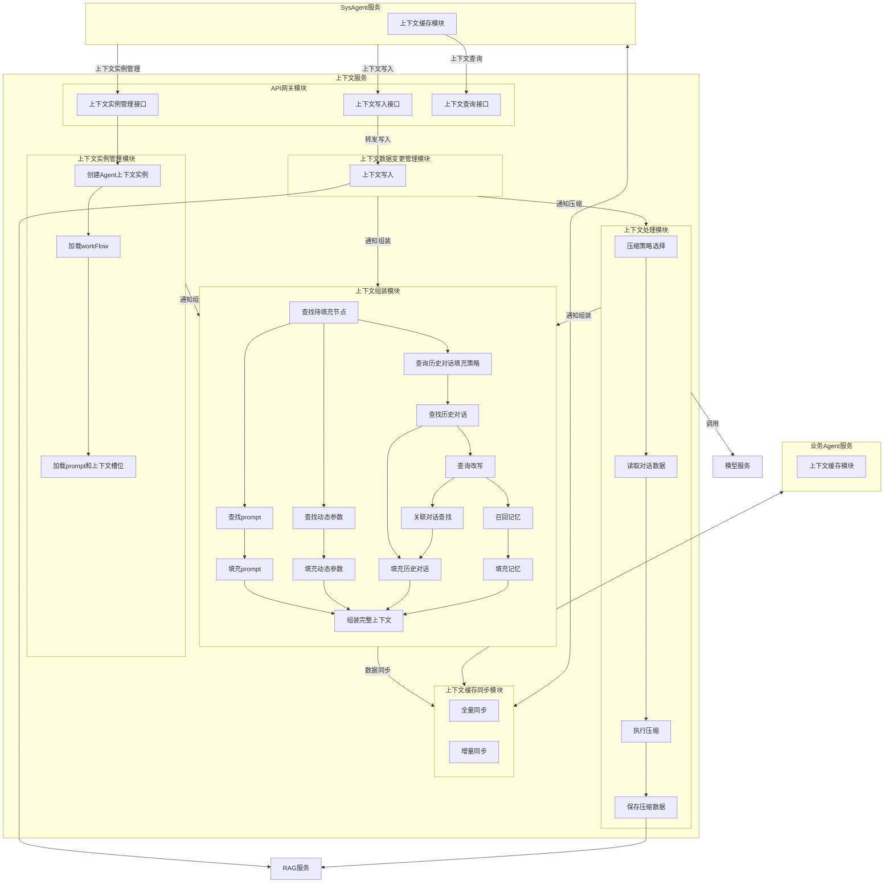

```mermaid
flowchart TD
    subgraph AgentService["业务Agent服务"]
        A1["上下文缓存模块"]
    end

    subgraph SysAgent["SysAgent服务"]
        A2["上下文缓存模块"]
    end
    
    
    subgraph ContextService["上下文服务"]
        direction TB

        subgraph CacheSync["上下文缓存同步模块"]
            CS1["全量同步"]
            CS2["增量同步"]
        end

         subgraph APIGW["API网关模块"]
            AW1["上下文实例管理接口"]
            AW2["上下文写入接口"]
            AW3["上下文查询接口"]
        end
    
        subgraph InstanceMgr["上下文实例管理模块"]
            direction TB
            IM2["创建Agent上下文实例"]
            IM5["加载workFlow"]
            IM6["加载prompt和上下文槽位"]


            IM2 --> IM5 --> IM6
        end

        subgraph DataChangeMgr["上下文数据变更管理模块"]
            DC1["上下文写入"]
        end

        subgraph ContextProcess["上下文处理模块"]
            direction TB
            CP1["压缩策略选择"]
            CP2["读取对话数据"]
            CP3["执行压缩"]
            CP4["保存压缩数据"]
            CP1 --> CP2 --> CP3 --> CP4
        end

        subgraph ContextAssemble["上下文组装模块"]
            direction TB
            CA1["查找待填充节点"]
            CA2["查找prompt"]
            CA3["查找动态参数"]
            CA4["查询历史对话填充策略"]
            CA5["填充prompt"]
            CA6["填充动态参数"]
            CA7["查找历史对话"]
            CA8["填充历史对话"]
            CA9["查询改写"]
            CA10["关联对话查找"]
            CA11["召回记忆"]
            CA12["填充记忆"]
            CA13["组装完整上下文"]

            CA1 --> CA2 --> CA5
            CA1 --> CA3 --> CA6
            CA1 --> CA4 --> CA7
            CA7 --> CA8
            CA7 --> CA9 --> CA10 --> CA8
            CA9 --> CA11 --> CA12 --> CA13
            CA5 --> CA13
            CA6 --> CA13
            CA8 --> CA13
        end

  
        InstanceMgr -->|通知组装| ContextAssemble
        DataChangeMgr -->|通知压缩| ContextProcess
        DataChangeMgr -->|通知组装| ContextAssemble
        ContextProcess -->|通知组装| ContextAssemble
        ContextAssemble -->|数据同步| CacheSync
    end

    LLM["模型服务"]
    RAG["RAG服务"]

    SysAgent -->|上下文实例管理| AW1
	SysAgent -->|上下文写入| AW2
	AW2 -->|转发写入| DC1
	A2 -->|上下文查询| AW3
	AW1 --> IM2
	DC1 --> RAG
	CP4 --> RAG
	
    AgentService <--> CacheSync
	SysAgent <--> CacheSync
    ContextProcess -->|调用| LLM


```
